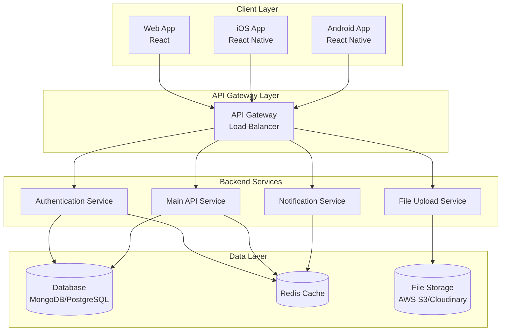
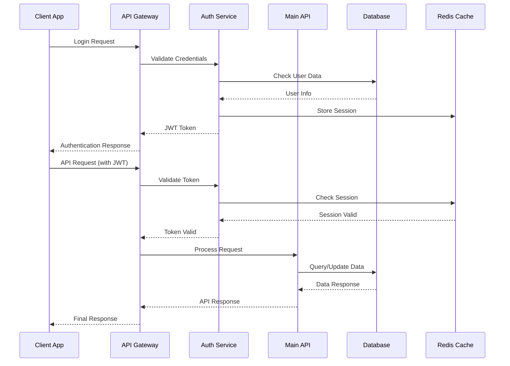
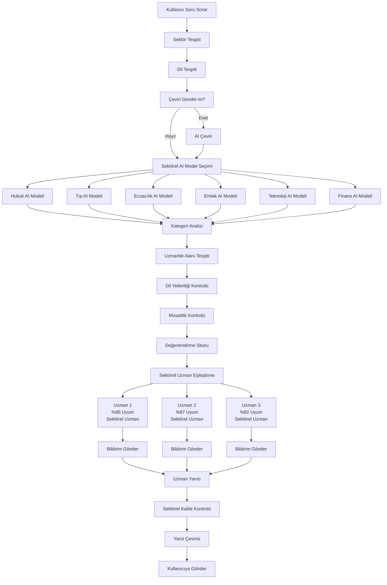
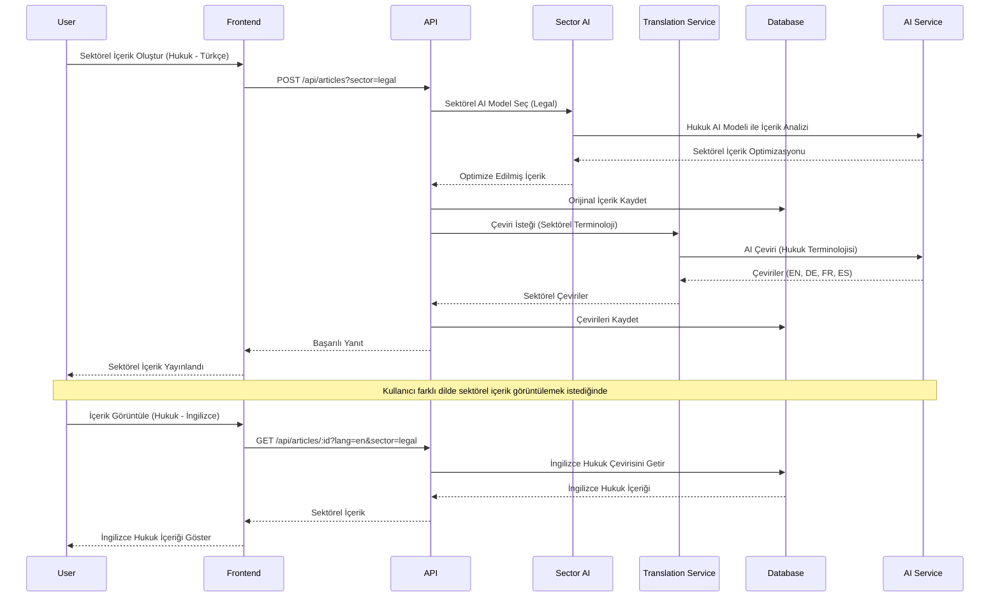
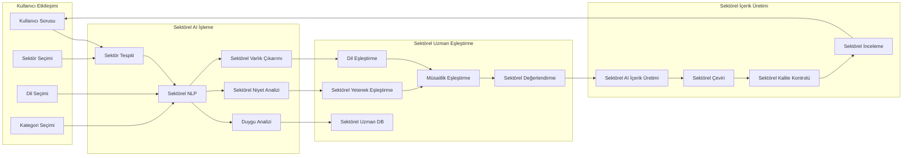
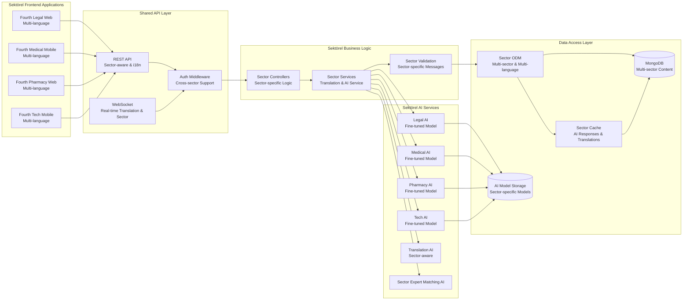

# Fourth - Sektörel AI Destekli Uzman Platformu

**Fourth**, her sektör için özelleştirilmiş yapay zeka destekli uzman bilgi platformudur. Aynı teknolojik altyapı üzerine inşa edilmiş, fakat her sektörün ihtiyaçlarına göre özelleştirilmiş ayrı uygulamalar sunar.

## 🎯 Proje Amacı

Fourth, sektörel uzmanlık platformları ekosistemi oluşturarak aşağıdaki ihtiyaçları karşılar:

- **Sektörel Özelleştirme**: Her sektör için özel olarak eğitilmiş AI modelleri
- **Çok Dilli Destek**: Tüm uygulamalar 20+ dilde hizmet verir
- **Modüler Mimari**: Aynı backend, farklı frontend uygulamaları
- **AI Uzmanlaşması**: Her sektör için özel eğitilmiş yapay zeka asistanları
- **Sektörel İçerik**: Her alanın kendine özgü terminolojisi ve süreçleri
- **Uzman Ağı**: Sektörel uzmanlar arasında bilgi paylaşımı

## 🏢 Sektörel Uygulamalar

### Hukuk Sektörü - **Fourth Legal**
- **Hedef Kitle**: Avukatlar, hukuk öğrencileri, hukuk danışmanları
- **AI Özellikleri**: Yasal dava analizi, sözleşme inceleme, hukuki araştırma
- **Özel Modüller**: Dava takibi, müvekkil yönetimi, mahkeme takvimi

### Sağlık Sektörü - **Fourth Medical**
- **Hedef Kitle**: Doktorlar, hemşireler, sağlık çalışanları
- **AI Özellikleri**: Teşhis desteği, ilaç etkileşimleri, hasta takibi
- **Özel Modüller**: Hasta kayıtları, reçete yönetimi, randevu sistemi

### Eczacılık Sektörü - **Fourth Pharmacy**
- **Hedef Kitle**: Eczacılar, eczane teknisyenleri, ilaç danışmanları
- **AI Özellikleri**: İlaç etkileşim kontrolü, dozaj hesaplama, yan etki analizi
- **Özel Modüller**: Stok yönetimi, reçete işleme, hasta danışmanlığı

### Emlak Sektörü - **Fourth Real Estate**
- **Hedef Kitle**: Emlak danışmanları, emlak yatırımcıları, müşteriler
- **AI Özellikleri**: Fiyat tahmini, piyasa analizi, müşteri eşleştirme
- **Özel Modüller**: İlan yönetimi, müşteri takibi, sözleşme hazırlama

### Teknoloji Sektörü - **Fourth Tech**
- **Hedef Kitle**: Yazılım geliştiriciler, IT uzmanları, teknoloji danışmanları
- **AI Özellikleri**: Kod analizi, güvenlik açığı tespiti, performans optimizasyonu
- **Özel Modüller**: Proje yönetimi, kod paylaşımı, teknik dokümantasyon

### Finans Sektörü - **Fourth Finance**
- **Hedef Kitle**: Finansal danışmanlar, muhasebeciler, yatırım uzmanları
- **AI Özellikleri**: Risk analizi, yatırım önerileri, mali raporlama
- **Özel Modüller**: Portföy yönetimi, müşteri danışmanlığı, uyumluluk takibi

## Proje Yapısı

```
fourth/
├── backend/                 # Shared Backend API
│   ├── src/
│   │   ├── controllers/     # API endpoint controllers
│   │   ├── models/          # Database models
│   │   ├── routes/          # API routes
│   │   ├── middleware/      # Authentication, validation, etc.
│   │   ├── services/        # Business logic
│   │   ├── ai/              # AI service integrations
│   │   └── utils/           # Utility functions
│   ├── config/              # Database and app configuration
│   ├── tests/               # Backend tests
│   └── package.json
├── apps/                    # Sektörel Uygulamalar
│   ├── legal/               # Fourth Legal
│   │   ├── web/             # React Web App
│   │   ├── mobile/          # React Native App
│   │   └── ai-models/       # Hukuk AI modelleri
│   ├── medical/             # Fourth Medical
│   │   ├── web/             # React Web App
│   │   ├── mobile/          # React Native App
│   │   └── ai-models/       # Tıp AI modelleri
│   ├── pharmacy/            # Fourth Pharmacy
│   │   ├── web/             # React Web App
│   │   ├── mobile/          # React Native App
│   │   └── ai-models/       # Eczacılık AI modelleri
│   ├── real-estate/         # Fourth Real Estate
│   │   ├── web/             # React Web App
│   │   ├── mobile/          # React Native App
│   │   └── ai-models/       # Emlak AI modelleri
│   ├── tech/                # Fourth Tech
│   │   ├── web/             # React Web App
│   │   ├── mobile/          # React Native App
│   │   └── ai-models/       # Teknoloji AI modelleri
│   └── finance/             # Fourth Finance
│       ├── web/             # React Web App
│       ├── mobile/          # React Native App
│       └── ai-models/       # Finans AI modelleri
├── shared/                  # Paylaşılan Bileşenler
│   ├── components/          # Ortak UI bileşenleri
│   ├── services/            # Ortak servisler
│   ├── utils/               # Ortak yardımcı fonksiyonlar
│   └── types/               # TypeScript tip tanımları
├── ai-training/             # AI Model Eğitimi
│   ├── legal/               # Hukuk modeli eğitim verileri
│   ├── medical/             # Tıp modeli eğitim verileri
│   ├── pharmacy/            # Eczacılık modeli eğitim verileri
│   ├── real-estate/         # Emlak modeli eğitim verileri
│   ├── tech/                # Teknoloji modeli eğitim verileri
│   └── finance/             # Finans modeli eğitim verileri
└── docs/                    # Documentation
    ├── api/                 # API documentation
    ├── architecture/        # System architecture docs
    └── deployment/          # Deployment guides
```

## 🌟 Temel Özellikler

### Çok Dilli Destek
- **20+ Dil Desteği**: Türkçe, İngilizce, Almanca, Fransızca, İspanyolca, Arapça, Çince ve daha fazlası
- **Otomatik Çeviri**: AI destekli gerçek zamanlı çeviri
- **Yerelleştirme**: Her dil için özelleştirilmiş arayüz ve içerik

### Uzmanlık Alanları
- **Hukuk**: Ceza hukuku, ticaret hukuku, aile hukuku, uluslararası hukuk
- **Tıp**: Genel tıp, uzmanlık dalları, acil tıp, psikiyatri
- **Teknoloji**: Yazılım geliştirme, siber güvenlik, yapay zeka, blockchain
- **Mühendislik**: Makine, elektrik, inşaat, endüstri mühendisliği
- **Finans**: Muhasebe, yatırım, risk yönetimi, kripto para
- **Eğitim**: Öğretmenlik, eğitim teknolojileri, özel eğitim

### Sektörel AI Modelleri
- **Özelleştirilmiş AI**: Her sektör için ayrı eğitilmiş yapay zeka modelleri
- **Sektörel Terminoloji**: Her alanın kendine özgü dil ve kavramları
- **Uzman Eşleştirme**: Sektörel uzmanlık alanına göre akıllı eşleştirme
- **İçerik Üretimi**: Sektörel ihtiyaçlara göre özelleştirilmiş içerik
- **Kalite Kontrolü**: Sektörel standartlara uygunluk analizi

### Modüler Mimari
- **Tek Backend**: Tüm sektörel uygulamalar için ortak API
- **Çoklu Frontend**: Her sektör için özelleştirilmiş arayüzler
- **Paylaşılan Bileşenler**: Ortak UI ve servis bileşenleri
- **Sektörel Özelleştirme**: Her uygulama kendi ihtiyaçlarına göre yapılandırılabilir

## Teknoloji Stack

### Backend
- **Node.js** - Runtime environment
- **Express.js** - Web framework
- **MongoDB** - NoSQL database (çok dilli içerik için ideal)
- **Redis** - Caching ve session management
- **JWT** - Authentication
- **Socket.io** - Gerçek zamanlı iletişim
- **OpenAI API** - AI entegrasyonu
- **Google Translate API** - Çeviri servisleri
- **Swagger** - API documentation

### Frontend Web
- **React** - UI library
- **TypeScript** - Type safety
- **Material-UI** - UI components
- **React Query** - State management
- **i18next** - Uluslararasılaştırma
- **Socket.io-client** - Gerçek zamanlı iletişim

### Mobile
- **React Native** - Cross-platform mobile development
- **TypeScript** - Type safety
- **React Navigation** - Navigation
- **NativeBase** - UI components
- **react-native-localize** - Çok dilli destek

### AI & ML
- **OpenAI GPT-4** - Genel doğal dil işleme
- **Sektörel Fine-tuned Models** - Her sektör için özel eğitilmiş modeller
- **Google Translate** - Çeviri servisleri
- **Custom ML Models** - Sektörel uzman eşleştirme algoritmaları
- **Hugging Face Transformers** - Sektörel model eğitimi
- **LangChain** - AI uygulama geliştirme framework'ü

## Sistem Mimarisi

### Genel Mimari Akışı



### API İletişim Akışı



### Sektörel Platform Mimarisi

```mermaid
graph TB
    subgraph "Sektörel Uygulamalar"
        LEGAL[Fourth Legal<br/>Web + Mobile]
        MEDICAL[Fourth Medical<br/>Web + Mobile]
        PHARMACY[Fourth Pharmacy<br/>Web + Mobile]
        REALESTATE[Fourth Real Estate<br/>Web + Mobile]
        TECH[Fourth Tech<br/>Web + Mobile]
        FINANCE[Fourth Finance<br/>Web + Mobile]
    end
    
    subgraph "Shared Backend API"
        GATEWAY[API Gateway<br/>Sector Detection<br/>Multi-language Support]
        AUTH[Authentication Service<br/>Cross-sector Support]
        USER[User Management<br/>Sector-specific Profiles]
        CONTENT[Content Management<br/>Sector-specific Content]
        AI[AI Service Router<br/>Sector Model Selection]
        CHAT[Real-time Chat<br/>Multi-language & Sector]
    end
    
    subgraph "Sektörel AI Modelleri"
        LEGAL_AI[Legal AI Model<br/>Fine-tuned for Law]
        MEDICAL_AI[Medical AI Model<br/>Fine-tuned for Healthcare]
        PHARMACY_AI[Pharmacy AI Model<br/>Fine-tuned for Pharmacy]
        REALESTATE_AI[Real Estate AI Model<br/>Fine-tuned for Property]
        TECH_AI[Tech AI Model<br/>Fine-tuned for Technology]
        FINANCE_AI[Finance AI Model<br/>Fine-tuned for Finance]
    end
    
    subgraph "Shared AI Services"
        OPENAI[OpenAI GPT-4<br/>General Content Generation]
        TRANSLATE[Google Translate<br/>Multi-language Translation]
        MATCH[Expert Matching<br/>Sector-aware Algorithm]
        QUALITY[Content Quality<br/>Sector-specific Analysis]
    end
    
    subgraph "Data Layer"
        MONGODB[(MongoDB<br/>Multi-sector & Multi-language)]
        REDIS[(Redis Cache<br/>Sessions & AI Responses)]
        FILES[(File Storage<br/>Sector-specific Documents)]
        AI_MODELS[(AI Model Storage<br/>Sector-specific Models)]
    end
    
    LEGAL --> GATEWAY
    MEDICAL --> GATEWAY
    PHARMACY --> GATEWAY
    REALESTATE --> GATEWAY
    TECH --> GATEWAY
    FINANCE --> GATEWAY
    
    GATEWAY --> AUTH
    GATEWAY --> USER
    GATEWAY --> CONTENT
    GATEWAY --> AI
    GATEWAY --> CHAT
    
    AI --> LEGAL_AI
    AI --> MEDICAL_AI
    AI --> PHARMACY_AI
    AI --> REALESTATE_AI
    AI --> TECH_AI
    AI --> FINANCE_AI
    
    AI --> OPENAI
    AI --> TRANSLATE
    AI --> MATCH
    AI --> QUALITY
    
    AUTH --> MONGODB
    USER --> MONGODB
    CONTENT --> MONGODB
    CHAT --> REDIS
    AI --> REDIS
    CONTENT --> FILES
    AI --> AI_MODELS
```



### Sektörel Uzman Eşleştirme Algoritması



### Sektörel İçerik Yönetimi



### Sektörel AI Platform Akışı



### Sektörel Veri Akışı Diyagramı



## 📚 Platform Özellikleri

### Uzman Profil Sistemi
- **Uzmanlık Alanları**: Kullanıcılar birden fazla uzmanlık alanı seçebilir
- **Dil Yetkinlikleri**: Her uzman hangi dillerde hizmet verebileceğini belirtir
- **Deneyim Seviyesi**: Başlangıç, orta, ileri, uzman seviyeleri
- **Sertifikalar**: Uzmanlık belgeleri ve sertifikaların yüklenmesi
- **Değerlendirme Sistemi**: Kullanıcıların uzmanları değerlendirmesi

### İçerik Yönetimi
- **Makaleler**: Uzmanlar tarafından yazılan teknik makaleler
- **Soru-Cevap**: Kullanıcıların uzmanlara sorduğu sorular
- **Videolar**: Eğitim videoları ve canlı yayınlar
- **Dokümanlar**: PDF, Word ve diğer formatlarda kaynaklar
- **Çok Dilli İçerik**: Her içerik birden fazla dilde sunulabilir

### AI Destekli Özellikler
- **Akıllı Arama**: Doğal dil ile arama yapabilme
- **Otomatik Çeviri**: İçeriklerin otomatik çevrilmesi
- **İçerik Önerileri**: Kullanıcı ilgi alanlarına göre öneriler
- **Uzman Eşleştirme**: Soru türüne göre en uygun uzmanı bulma
- **Kalite Kontrolü**: AI destekli içerik kalitesi değerlendirmesi

## API Endpoint Yapısı

### Authentication Endpoints
- `POST /api/auth/login` - Kullanıcı girişi
- `POST /api/auth/register` - Kullanıcı kaydı
- `POST /api/auth/refresh` - Token yenileme
- `POST /api/auth/logout` - Çıkış yapma
- `POST /api/auth/forgot-password` - Şifre sıfırlama
- `POST /api/auth/reset-password` - Yeni şifre belirleme

### User Management Endpoints
- `GET /api/users` - Kullanıcı listesi (filtreleme ile)
- `GET /api/users/:id` - Kullanıcı detayı
- `PUT /api/users/:id` - Kullanıcı güncelleme
- `PUT /api/users/:id/expertise` - Uzmanlık alanları güncelleme
- `PUT /api/users/:id/languages` - Dil yetkinlikleri güncelleme
- `POST /api/users/:id/verify` - Uzman doğrulama

### Content Management Endpoints
- `GET /api/articles` - Makale listesi
- `POST /api/articles` - Yeni makale oluşturma
- `PUT /api/articles/:id` - Makale güncelleme
- `DELETE /api/articles/:id` - Makale silme
- `POST /api/articles/:id/translate` - Makale çevirisi

### Q&A System Endpoints
- `GET /api/questions` - Soru listesi
- `POST /api/questions` - Yeni soru sorma
- `PUT /api/questions/:id` - Soru güncelleme
- `POST /api/questions/:id/answer` - Soruya cevap verme
- `POST /api/questions/:id/ai-answer` - AI destekli cevap

### AI Integration Endpoints
- `POST /api/ai/translate` - Metin çevirisi
- `POST /api/ai/summarize` - İçerik özetleme
- `POST /api/ai/match-experts` - Uzman eşleştirme
- `POST /api/ai/generate-content` - AI içerik üretimi
- `POST /api/ai/analyze-quality` - İçerik kalitesi analizi

### Real-time Communication
- `WebSocket /socket.io` - Gerçek zamanlı mesajlaşma
- `POST /api/messages` - Mesaj gönderme
- `GET /api/messages/:conversationId` - Mesaj geçmişi
- `POST /api/calls/start` - Video/audio arama başlatma

## Güvenlik

- JWT tabanlı authentication
- CORS yapılandırması
- Rate limiting
- Input validation ve sanitization
- HTTPS zorunluluğu
- API key yönetimi

## Deployment

### Backend
- Docker containerization
- Kubernetes orchestration
- AWS/GCP/Azure cloud deployment
- CI/CD pipeline

### Frontend
- Web: Vercel/Netlify deployment
- Mobile: App Store/Play Store distribution

## 🚀 Geliştirme Süreci

### Faz 1: Temel Altyapı (6-8 hafta)
1. **Shared Backend API** - Tüm sektörler için ortak API
2. **Database tasarımı** - Multi-sector MongoDB schema
3. **Authentication sistemi** - Cross-sector kullanıcı desteği
4. **Temel CRUD operasyonları** - Sektörel kullanıcı ve içerik yönetimi

### Faz 2: AI Model Eğitimi (8-10 hafta)
1. **Sektörel veri toplama** - Her sektör için eğitim verileri
2. **AI model fine-tuning** - Sektörel özelleştirilmiş modeller
3. **Model optimizasyonu** - Performans ve doğruluk iyileştirme
4. **Model deployment** - Production ortamına model çıkarma

### Faz 3: Çok Dilli Destek (4-5 hafta)
1. **i18n entegrasyonu** - Tüm uygulamalarda çok dilli destek
2. **Sektörel çeviri servisleri** - Sektörel terminoloji çevirisi
3. **Yerelleştirme** - UI ve içerik yerelleştirmesi
4. **Dil seçimi** - Kullanıcı dil tercihi sistemi

### Faz 4: İlk Sektör Uygulaması (6-8 hafta)
1. **Fourth Legal geliştirme** - Hukuk sektörü uygulaması
2. **Web ve mobile uygulamaları** - React ve React Native
3. **Sektörel özellikler** - Hukuk terminolojisi ve süreçleri
4. **Test ve optimizasyon** - Kullanıcı deneyimi iyileştirme

### Faz 5: Diğer Sektörler (12-16 hafta)
1. **Fourth Medical** - Sağlık sektörü uygulaması
2. **Fourth Pharmacy** - Eczacılık sektörü uygulaması
3. **Fourth Real Estate** - Emlak sektörü uygulaması
4. **Fourth Tech** - Teknoloji sektörü uygulaması
5. **Fourth Finance** - Finans sektörü uygulaması

### Faz 6: Platform Optimizasyonu (4-6 hafta)
1. **Cross-sector entegrasyon** - Sektörler arası bilgi paylaşımı
2. **Performance optimization** - Hız ve verimlilik iyileştirme
3. **Advanced AI features** - Gelişmiş AI özellikleri
4. **Analytics ve monitoring** - Kullanım analizi ve izleme

### Faz 7: Test ve Deployment (4-6 hafta)
1. **Comprehensive testing** - Tüm sektörler için test
2. **Load testing** - Performans testleri
3. **Security testing** - Güvenlik testleri
4. **Production deployment** - Canlı ortama çıkarma

## 🎯 Hedef Kitle

### Birincil Kullanıcılar
- **Uzmanlar**: Hukuk, tıp, teknoloji, mühendislik alanlarında uzmanlaşmış profesyoneller
- **Öğrenenler**: Yeni bilgi edinmek isteyen öğrenciler ve profesyoneller
- **Araştırmacılar**: Akademik ve endüstriyel araştırmacılar

### İkincil Kullanıcılar
- **Eğitim kurumları**: Üniversiteler ve eğitim merkezleri
- **Şirketler**: İç eğitim ve uzmanlık transferi için
- **Hükümet kurumları**: Kamu hizmetleri ve politika geliştirme

## 💡 İş Modeli

### Gelir Kaynakları
1. **Sektörel Premium Üyelik**: Her sektör için ayrı premium paketler
2. **Uzman Komisyonu**: Sektörel uzman-hizmet alan arasındaki işlemlerden komisyon
3. **Kurumsal Lisanslar**: Şirketler için sektörel özel paketler
4. **Sektörel Reklamlar**: Hedefli sektörel reklamlar ve sponsorluklar
5. **API Lisansları**: Sektörel API erişimi için lisanslar
6. **AI Model Lisansları**: Sektörel AI modellerini kullanma lisansları
7. **Eğitim ve Sertifikasyon**: Sektörel eğitim programları ve sertifikalar

### Sektörel Pazarlama Stratejisi
- **Sektörel SEO**: Her sektör için özelleştirilmiş SEO stratejisi
- **Sektörel Sosyal Medya**: LinkedIn, sektörel forumlar ve gruplar
- **Sektörel İçerik Pazarlaması**: Her sektörün ihtiyaçlarına göre içerik
- **Sektörel Uzman Ortaklıkları**: Her alanda tanınmış uzmanlarla işbirliği
- **Sektörel Referans Programı**: Sektörel kullanıcı kazanımı
- **Sektörel Etkinlikler**: Konferanslar, seminerler ve workshop'lar

### Sektörel Dağıtım Stratejisi
- **App Store Optimizasyonu**: Her sektör için özelleştirilmiş ASO
- **Sektörel Web Siteleri**: Her sektör için ayrı landing page'ler
- **Sektörel Partnership**: Sektörel dernekler ve organizasyonlarla işbirliği
- **Sektörel Influencer Marketing**: Sektörel influencer'larla çalışma

## Katkıda Bulunma

1. Fork edin
2. Feature branch oluşturun (`git checkout -b feature/AmazingFeature`)
3. Commit edin (`git commit -m 'Add some AmazingFeature'`)
4. Push edin (`git push origin feature/AmazingFeature`)
5. Pull Request oluşturun

## Lisans

Bu proje MIT lisansı altında lisanslanmıştır.
