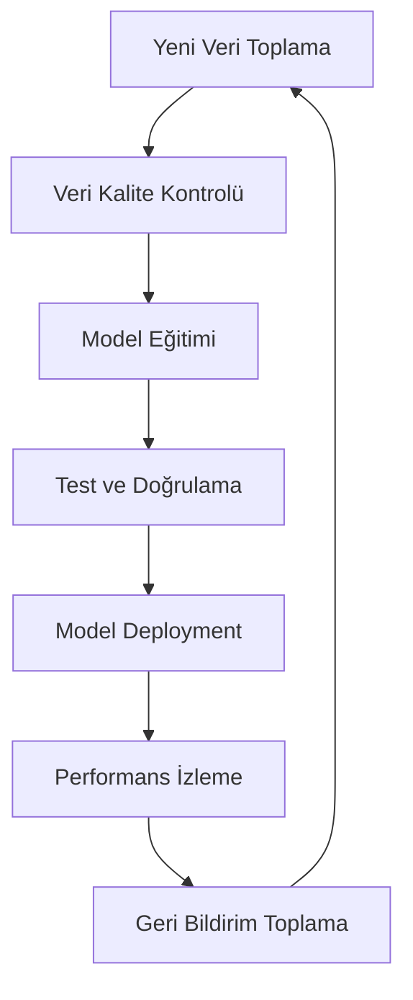
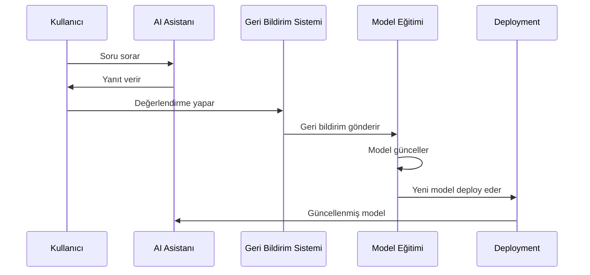

# 🤖 AI Eğitim Planı

## Genel Bakış

Fourth platformu, her sektör için özelleştirilmiş yapay zeka asistanları kullanır. Bu dokümanda, AI modellerinin eğitimi, sürekli öğrenme süreçleri ve kullanıcı etkileşiminden öğrenme stratejileri detaylandırılmıştır.

## 🎯 AI Eğitim Stratejisi

### 1. Sektörel Model Eğitimi

Her sektör için ayrı AI modelleri eğitilir:

- **Fourth Legal AI**: Hukuk terminolojisi ve süreçleri
- **Fourth Medical AI**: Tıp bilgisi ve teşhis desteği
- **Fourth Pharmacy AI**: İlaç bilgisi ve etkileşimleri
- **Fourth Real Estate AI**: Emlak piyasası ve değerlendirme
- **Fourth Tech AI**: Teknoloji ve yazılım geliştirme
- **Fourth Finance AI**: Finans ve yatırım analizi

### 2. Veri Toplama Stratejileri

#### A. Açık Kaynak Veri Kaynakları
- **Hukuk**: Yasal belgeler, mahkeme kararları, kanun metinleri
- **Tıp**: Tıbbi literatür, araştırma makaleleri, hasta verileri (anonim)
- **Eczacılık**: İlaç veritabanları, farmakoloji kaynakları
- **Emlak**: Piyasa verileri, emlak raporları, istatistikler
- **Teknoloji**: Kod depoları, teknik dokümantasyon, forumlar
- **Finans**: Finansal raporlar, piyasa verileri, analiz raporları

#### B. Uzman İçerikleri
- Sektörel uzmanların yazdığı makaleler
- Soru-cevap veritabanları
- Uzman görüşleri ve değerlendirmeleri
- Sektörel forum ve tartışma içerikleri

#### C. Kullanıcı Etkileşim Verileri
- Kullanıcı soruları ve uzman yanıtları
- Değerlendirme ve geri bildirimler
- Başarılı etkileşim örnekleri
- Kullanıcı davranış analizi

## 🔄 Sürekli Öğrenme Sistemi

### 1. Otomatik Model Güncelleme



### 2. Aşamalı Öğrenme

- **Haftalık**: Küçük güncellemeler ve iyileştirmeler
- **Aylık**: Orta ölçekli model güncellemeleri
- **Çeyrek yıllık**: Büyük model revizyonları
- **Yıllık**: Tam model yeniden eğitimi

## 📊 Veri İşleme Pipeline'ı

### 1. Veri Toplama
- **API Entegrasyonları**: Sektörel veri kaynaklarına bağlantı
- **Web Scraping**: Açık kaynak içerik toplama
- **Uzman Katkıları**: Platform üzerinden içerik girişi
- **Kullanıcı Etkileşimleri**: Anonim kullanıcı verileri

### 2. Veri Temizleme ve Hazırlama
- **Deduplikasyon**: Tekrarlanan içeriklerin temizlenmesi
- **Kalite Filtreleme**: Düşük kaliteli verilerin çıkarılması
- **Format Standardizasyonu**: Tutarlı veri formatı
- **Dil Standardizasyonu**: Çok dilli içerik işleme

### 3. Model Eğitimi
- **Fine-tuning**: Mevcut modellerin sektörel verilerle eğitimi
- **Transfer Learning**: Genel modellerden sektörel modellere aktarım
- **Reinforcement Learning**: Kullanıcı geri bildirimlerinden öğrenme
- **Multi-task Learning**: Birden fazla görevi aynı anda öğrenme

## 🎓 Kullanıcı Etkileşiminden Öğrenme

### 1. Geri Bildirim Sistemi

#### A. Açık Geri Bildirim
- Kullanıcı değerlendirmeleri (1-5 yıldız)
- Detaylı yorumlar ve öneriler
- Hata raporları ve düzeltme önerileri
- İyileştirme talepleri

#### B. Örtük Geri Bildirim
- Kullanıcı davranış analizi
- Tıklama oranları ve etkileşim süreleri
- Arama sonuçları tercihleri
- Başarılı etkileşim örnekleri

### 2. Öğrenme Algoritmaları

#### A. Reinforcement Learning
```python
# Örnek RL algoritması
class UserFeedbackLearner:
    def __init__(self, model):
        self.model = model
        self.feedback_buffer = []
    
    def collect_feedback(self, interaction, rating):
        self.feedback_buffer.append({
            'interaction': interaction,
            'rating': rating,
            'timestamp': time.now()
        })
    
    def update_model(self):
        # Geri bildirimlere göre model güncelleme
        positive_examples = [f for f in self.feedback_buffer if f['rating'] > 3]
        negative_examples = [f for f in self.feedback_buffer if f['rating'] <= 3]
        
        # Model parametrelerini güncelle
        self.model.fine_tune(positive_examples, negative_examples)
```

#### B. Active Learning
- Belirsiz durumları tespit etme
- Uzmanlardan ek bilgi isteme
- Hedefli veri toplama
- Model güven seviyesi analizi

### 3. Sürekli İyileştirme Döngüsü



## ⚖️ Getiri-Götürü Analizi

### 1. Kullanıcı Etkileşiminden Öğrenmenin Avantajları

#### ✅ Avantajlar
- **Gerçek Zamanlı İyileştirme**: Anlık kullanıcı ihtiyaçlarına adaptasyon
- **Kişiselleştirme**: Kullanıcı tercihlerine göre özelleştirme
- **Maliyet Etkinliği**: Ek veri toplama maliyeti yok
- **Sürekli Güncellik**: Güncel bilgi ve trendlere uyum
- **Kullanıcı Memnuniyeti**: Daha iyi hizmet kalitesi

#### ❌ Dezavantajlar
- **Güvenlik Riskleri**: Kullanıcı verilerinin korunması
- **Gizlilik Endişeleri**: Kişisel bilgilerin korunması
- **Bias Riski**: Kullanıcı tercihlerinden kaynaklanan önyargı
- **Kalite Kontrolü**: Yanlış geri bildirimlerin etkisi
- **Teknik Karmaşıklık**: Sürekli öğrenme sisteminin yönetimi

### 2. Alternatif Yaklaşımlar

#### A. Hibrit Yaklaşım (Önerilen)
- **%70 Uzman Verisi**: Sektörel uzmanlardan toplanan veriler
- **%20 Açık Kaynak**: Kamu verileri ve literatür
- **%10 Kullanıcı Etkileşimi**: Anonim kullanıcı geri bildirimleri

#### B. Konservatif Yaklaşım
- **%90 Uzman Verisi**: Sadece uzman onaylı veriler
- **%10 Açık Kaynak**: Güvenilir kaynaklardan veriler
- **%0 Kullanıcı Etkileşimi**: Kullanıcı verileri kullanılmaz

#### C. Agresif Yaklaşım
- **%50 Uzman Verisi**: Temel uzman bilgileri
- **%30 Açık Kaynak**: Geniş veri kaynakları
- **%20 Kullanıcı Etkileşimi**: Yoğun kullanıcı geri bildirimi

## 🛡️ Güvenlik ve Gizlilik

### 1. Veri Koruma Önlemleri
- **Anonimleştirme**: Tüm kullanıcı verileri anonimleştirilir
- **Şifreleme**: Veri transferi ve depolama şifreleme
- **Erişim Kontrolü**: Sınırlı erişim yetkileri
- **Audit Logging**: Tüm işlemlerin kayıt altına alınması

### 2. Yasal Uyumluluk
- **GDPR**: Avrupa veri koruma yönetmeliği
- **CCPA**: Kaliforniya tüketici gizlilik yasası
- **HIPAA**: Sağlık bilgileri koruma (Medical AI için)
- **Sektörel Düzenlemeler**: Her sektörün kendi yasal gereklilikleri

## 📈 Performans Metrikleri

### 1. Model Performansı
- **Doğruluk Oranı**: Yanıt doğruluğu
- **Yanıt Süresi**: Kullanıcı bekleme süresi
- **Kullanıcı Memnuniyeti**: Değerlendirme skorları
- **Öğrenme Hızı**: Yeni bilgileri öğrenme süresi

### 2. İş Metrikleri
- **Kullanıcı Etkileşimi**: Günlük aktif kullanıcı sayısı
- **Retention Rate**: Kullanıcı geri dönüş oranı
- **Conversion Rate**: Ücretsiz'den premium'a geçiş
- **Revenue per User**: Kullanıcı başına gelir

## 🔮 Gelecek Planları

### 1. Kısa Vadeli (6 ay)
- İlk sektörel modellerin eğitimi
- Temel geri bildirim sistemi
- Güvenlik önlemlerinin uygulanması

### 2. Orta Vadeli (1-2 yıl)
- Gelişmiş öğrenme algoritmaları
- Çok dilli model eğitimi
- Sektörler arası bilgi transferi

### 3. Uzun Vadeli (2+ yıl)
- Tam otonom öğrenme sistemi
- Gerçek zamanlı model güncelleme
- Yapay zeka etiği ve sorumluluk çerçevesi

## 📋 Karar Matrisi

| Kriter | Hibrit Yaklaşım | Konservatif | Agresif |
|--------|----------------|-------------|---------|
| Güvenlik | ⭐⭐⭐⭐ | ⭐⭐⭐⭐⭐ | ⭐⭐ |
| Kalite | ⭐⭐⭐⭐ | ⭐⭐⭐⭐⭐ | ⭐⭐⭐ |
| Hız | ⭐⭐⭐⭐ | ⭐⭐ | ⭐⭐⭐⭐⭐ |
| Maliyet | ⭐⭐⭐⭐ | ⭐⭐ | ⭐⭐⭐ |
| Ölçeklenebilirlik | ⭐⭐⭐⭐⭐ | ⭐⭐ | ⭐⭐⭐⭐⭐ |

**Önerilen Yaklaşım**: Hibrit yaklaşım, güvenlik, kalite ve hız arasında en iyi dengeyi sağlar.
