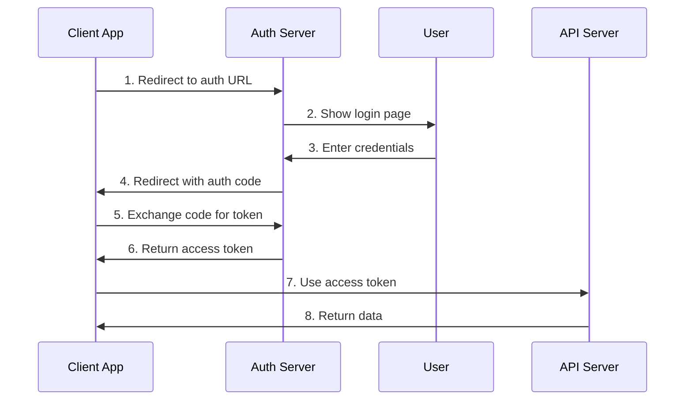

# 📡 API Dokümantasyonu

## Genel Bakış

Fourth platformu, RESTful ve GraphQL API'leri sunarak geliştiricilere ve üçüncü parti uygulamalara kapsamlı entegrasyon imkanları sağlar. Bu dokümanda API endpoint'leri, authentication, rate limiting ve kullanım örnekleri detaylandırılmıştır.

## 🔗 Base URL

### Environment URLs
- **Production**: `https://api.fourth.com/api`
- **Staging**: `https://staging-api.fourth.com/api`
- **Development**: `http://localhost:3000/api`

### API Versions
- **Current**: `/api` - Current stable version
- **v2**: `/api/v2` - Beta version (coming soon)
- **v3**: `/api/v3` - Alpha version (experimental)

## 🔐 Authentication

### JWT Token Authentication

#### Getting JWT Token
```bash
# Register for JWT token
curl -X POST http://localhost:3000/api/auth/register \
  -H "Content-Type: application/json" \
  -d '{
    "email": "developer@example.com",
    "password": "securepassword",
    "firstName": "John",
    "lastName": "Doe"
  }'
```

#### Using JWT Token
```bash
# Include JWT token in header
curl -X GET http://localhost:3000/api/auth/me \
  -H "Authorization: Bearer YOUR_JWT_TOKEN"
```

#### Token Refresh
```bash
# Refresh expired token
curl -X POST http://localhost:3000/api/auth/refresh \
  -H "Content-Type: application/json" \
  -d '{
    "refreshToken": "YOUR_REFRESH_TOKEN"
  }'
```

### OAuth 2.0 Authentication

#### Authorization Flow


#### OAuth Endpoints
- **Authorization**: `GET /oauth/authorize`
- **Token**: `POST /oauth/token`
- **Refresh**: `POST /oauth/refresh`
- **Revoke**: `POST /oauth/revoke`

## 📊 Rate Limiting

### Rate Limit Headers
```
X-RateLimit-Limit: 1000
X-RateLimit-Remaining: 999
X-RateLimit-Reset: 1640995200
X-RateLimit-Retry-After: 60
```

### Rate Limit Tiers
| Tier | Requests/Minute | Requests/Hour | Requests/Day |
|------|----------------|---------------|--------------|
| **Free** | 60 | 1,000 | 10,000 |
| **Basic** | 300 | 10,000 | 100,000 |
| **Professional** | 1,000 | 50,000 | 500,000 |
| **Enterprise** | 5,000 | 200,000 | 2,000,000 |

### Rate Limit Response
```json
{
  "error": "rate_limit_exceeded",
  "message": "Rate limit exceeded. Try again in 60 seconds.",
  "retry_after": 60,
  "limit": 1000,
  "remaining": 0,
  "reset": 1640995200
}
```

## 🏗️ API Endpoints

### Authentication Endpoints

#### POST /api/auth/register
Register a new user account.

**Request Body:**
```json
{
  "email": "user@example.com",
  "password": "securepassword",
  "firstName": "John",
  "lastName": "Doe"
}
```

**Response:**
```json
{
  "success": true,
  "message": "User registered successfully",
  "data": {
    "user": {
      "id": "user_id",
      "email": "user@example.com",
      "firstName": "John",
      "lastName": "Doe",
      "role": "user",
      "isActive": true,
      "createdAt": "2024-01-01T00:00:00.000Z",
      "updatedAt": "2024-01-01T00:00:00.000Z"
    },
    "token": "jwt_access_token",
    "refreshToken": "jwt_refresh_token"
  }
}
```

#### POST /api/auth/login
Authenticate user and return JWT tokens.

**Request Body:**
```json
{
  "email": "user@example.com",
  "password": "securepassword"
}
```

**Response:**
```json
{
  "success": true,
  "message": "Login successful",
  "data": {
    "user": {
      "id": "user_id",
      "email": "user@example.com",
      "firstName": "John",
      "lastName": "Doe",
      "role": "user",
      "isActive": true,
      "lastLogin": "2024-01-01T00:00:00.000Z"
    },
    "token": "jwt_access_token",
    "refreshToken": "jwt_refresh_token"
  }
}
```

#### POST /api/auth/refresh
Refresh expired JWT token.

**Request Body:**
```json
{
  "refreshToken": "jwt_refresh_token"
}
```

**Response:**
```json
{
  "success": true,
  "message": "Token refreshed successfully",
  "data": {
    "token": "new_jwt_access_token",
    "refreshToken": "new_jwt_refresh_token"
  }
}
```

#### POST /api/auth/logout
Logout user (requires authentication).

**Headers:**
```
Authorization: Bearer jwt_access_token
```

**Response:**
```json
{
  "success": true,
  "message": "Logout successful"
}
```

#### GET /api/auth/me
Get current user information (requires authentication).

**Headers:**
```
Authorization: Bearer jwt_access_token
```

**Response:**
```json
{
  "success": true,
  "data": {
    "user": {
      "id": "user_id",
      "email": "user@example.com",
      "firstName": "John",
      "lastName": "Doe",
      "role": "user",
      "isActive": true,
      "createdAt": "2024-01-01T00:00:00.000Z",
      "updatedAt": "2024-01-01T00:00:00.000Z"
    }
  }
}
```

### User Management Endpoints

#### GET /api/users
Get all users with pagination (Admin only).

**Headers:**
```
Authorization: Bearer jwt_access_token
```

**Query Parameters:**
- `page` (optional): Page number (default: 1)
- `limit` (optional): Items per page (default: 10, max: 100)
- `search` (optional): Search term for name or email

**Response:**
```json
{
  "success": true,
  "data": {
    "users": [
      {
        "id": "user_id",
        "email": "user@example.com",
        "firstName": "John",
        "lastName": "Doe",
        "role": "user",
        "isActive": true,
        "createdAt": "2024-01-01T00:00:00.000Z",
        "updatedAt": "2024-01-01T00:00:00.000Z"
      }
    ],
    "pagination": {
      "currentPage": 1,
      "totalPages": 5,
      "totalUsers": 50,
      "hasNextPage": true,
      "hasPrevPage": false
    }
  }
}
```

#### GET /api/users/:id
Get user by ID.

**Headers:**
```
Authorization: Bearer jwt_access_token
```

**Path Parameters:**
- `id`: User ID

**Response:**
```json
{
  "success": true,
  "data": {
    "user": {
      "id": "user_id",
      "email": "user@example.com",
      "firstName": "John",
      "lastName": "Doe",
      "role": "user",
      "isActive": true,
      "createdAt": "2024-01-01T00:00:00.000Z",
      "updatedAt": "2024-01-01T00:00:00.000Z"
    }
  }
}
```

#### PUT /api/users/:id
Update user information.

**Headers:**
```
Authorization: Bearer jwt_access_token
```

**Path Parameters:**
- `id`: User ID

**Request Body:**
```json
{
  "firstName": "John",
  "lastName": "Doe",
  "email": "newemail@example.com"
}
```

**Response:**
```json
{
  "success": true,
  "message": "User updated successfully",
  "data": {
    "user": {
      "id": "user_id",
      "email": "newemail@example.com",
      "firstName": "John",
      "lastName": "Doe",
      "role": "user",
      "isActive": true,
      "updatedAt": "2024-01-01T00:00:00.000Z"
    }
  }
}
```

#### DELETE /api/users/:id
Delete user (Admin only).

**Headers:**
```
Authorization: Bearer jwt_access_token
```

**Path Parameters:**
- `id`: User ID

**Response:**
```json
{
  "success": true,
  "message": "User deleted successfully"
}
```

#### PUT /api/users/:id/role
Update user role (Admin only).

**Headers:**
```
Authorization: Bearer jwt_access_token
```

**Path Parameters:**
- `id`: User ID

**Request Body:**
```json
{
  "role": "admin"
}
```

**Response:**
```json
{
  "success": true,
  "message": "User role updated successfully",
  "data": {
    "user": {
      "id": "user_id",
      "role": "admin",
      "updatedAt": "2024-01-01T00:00:00.000Z"
    }
  }
}
```

### Data Management Endpoints

#### GET /api/data
Get all data items with pagination and filtering.

**Query Parameters:**
- `page` (optional): Page number (default: 1)
- `limit` (optional): Items per page (default: 10, max: 100)
- `category` (optional): Filter by category
- `search` (optional): Search term

**Response:**
```json
{
  "success": true,
  "data": {
    "items": [
      {
        "id": 1,
        "title": "Sample Data 1",
        "description": "This is a sample data item",
        "category": "general",
        "createdAt": "2024-01-01T00:00:00.000Z",
        "updatedAt": "2024-01-01T00:00:00.000Z"
      }
    ],
    "pagination": {
      "currentPage": 1,
      "totalPages": 5,
      "totalItems": 50,
      "hasNextPage": true,
      "hasPrevPage": false
    }
  }
}
```

#### GET /api/data/:id
Get data item by ID.

**Path Parameters:**
- `id`: Data item ID

**Response:**
```json
{
  "success": true,
  "data": {
    "item": {
      "id": 1,
      "title": "Sample Data 1",
      "description": "This is a sample data item",
      "category": "general",
      "createdAt": "2024-01-01T00:00:00.000Z",
      "updatedAt": "2024-01-01T00:00:00.000Z"
    }
  }
}
```

#### POST /api/data
Create new data item (requires authentication).

**Headers:**
```
Authorization: Bearer jwt_access_token
```

**Request Body:**
```json
{
  "title": "New Data Item",
  "description": "Description of the new data item",
  "category": "general"
}
```

**Response:**
```json
{
  "success": true,
  "message": "Data item created successfully",
  "data": {
    "item": {
      "id": 3,
      "title": "New Data Item",
      "description": "Description of the new data item",
      "category": "general",
      "createdAt": "2024-01-01T00:00:00.000Z",
      "updatedAt": "2024-01-01T00:00:00.000Z"
    }
  }
}
```

#### PUT /api/data/:id
Update data item (requires authentication).

**Headers:**
```
Authorization: Bearer jwt_access_token
```

**Path Parameters:**
- `id`: Data item ID

**Request Body:**
```json
{
  "title": "Updated Data Item",
  "description": "Updated description",
  "category": "important"
}
```

**Response:**
```json
{
  "success": true,
  "message": "Data item updated successfully",
  "data": {
    "item": {
      "id": 1,
      "title": "Updated Data Item",
      "description": "Updated description",
      "category": "important",
      "updatedAt": "2024-01-01T00:00:00.000Z"
    }
  }
}
```

#### DELETE /api/data/:id
Delete data item (requires authentication).

**Headers:**
```
Authorization: Bearer jwt_access_token
```

**Path Parameters:**
- `id`: Data item ID

**Response:**
```json
{
  "success": true,
  "message": "Data item deleted successfully"
}
```

#### GET /api/data/categories
Get all available categories.

**Response:**
```json
{
  "success": true,
  "data": {
    "categories": [
      "general",
      "important",
      "urgent",
      "archived"
    ]
  }
}
```

## 🔄 Flow Diyagramları

Detaylı API flow diyagramları için [Flow Diyagramları](flow-diagrams.md) dokümantasyonunu inceleyebilirsiniz.

## 📊 Error Handling

### Common Error Responses

#### 400 Bad Request
```json
{
  "success": false,
  "message": "Validation failed",
  "errors": [
    {
      "field": "email",
      "message": "Please provide a valid email"
    }
  ]
}
```

#### 401 Unauthorized
```json
{
  "success": false,
  "message": "Access token required"
}
```

#### 403 Forbidden
```json
{
  "success": false,
  "message": "Insufficient permissions"
}
```

#### 404 Not Found
```json
{
  "success": false,
  "message": "Resource not found"
}
```

#### 429 Too Many Requests
```json
{
  "success": false,
  "message": "Rate limit exceeded",
  "retryAfter": 60
}
```

#### 500 Internal Server Error
```json
{
  "success": false,
  "message": "Internal server error"
}
```

## 🔧 Development Setup

### Local Development
```bash
# Start backend server
cd backend
npm install
npm run dev

# Server will run on http://localhost:3000
```

### API Testing
```bash
# Test authentication
curl -X POST http://localhost:3000/api/auth/register \
  -H "Content-Type: application/json" \
  -d '{"email":"test@example.com","password":"password123","firstName":"Test","lastName":"User"}'

# Test protected endpoint
curl -X GET http://localhost:3000/api/auth/me \
  -H "Authorization: Bearer YOUR_JWT_TOKEN"
```

## 📚 Additional Resources

- [Flow Diyagramları](flow-diagrams.md) - Detaylı API akış diyagramları
- [Sistem Mimarisi](system-architecture.md) - Teknik mimari dokümantasyonu
- [Güvenlik](security.md) - Güvenlik önlemleri ve standartlar
