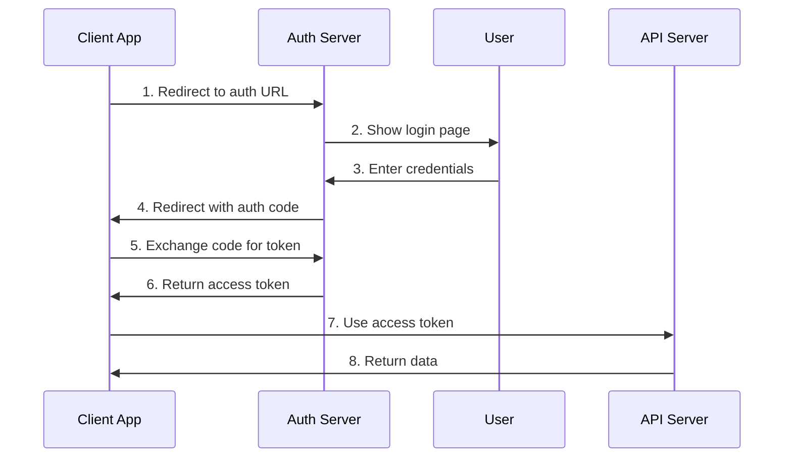

# 📡 API Dokümantasyonu

## Genel Bakış

Fourth platformu, RESTful ve GraphQL API'leri sunarak geliştiricilere ve üçüncü parti uygulamalara kapsamlı entegrasyon imkanları sağlar. Bu dokümanda API endpoint'leri, authentication, rate limiting ve kullanım örnekleri detaylandırılmıştır.

## 🔗 Base URL

### Environment URLs
- **Production**: `https://api.fourth.com/v1`
- **Staging**: `https://staging-api.fourth.com/v1`
- **Development**: `https://dev-api.fourth.com/v1`

### API Versions
- **v1**: Current stable version
- **v2**: Beta version (coming soon)
- **v3**: Alpha version (experimental)

## 🔐 Authentication

### API Key Authentication

#### Getting API Key
```bash
# Register for API key
curl -X POST https://api.fourth.com/v1/auth/register \
  -H "Content-Type: application/json" \
  -d '{
    "email": "developer@example.com",
    "password": "securepassword",
    "company": "Your Company"
  }'
```

#### Using API Key
```bash
# Include API key in header
curl -X GET https://api.fourth.com/v1/user/profile \
  -H "Authorization: Bearer YOUR_API_KEY"
```

### OAuth 2.0 Authentication

#### Authorization Flow


#### OAuth Endpoints
- **Authorization**: `GET /oauth/authorize`
- **Token**: `POST /oauth/token`
- **Refresh**: `POST /oauth/refresh`
- **Revoke**: `POST /oauth/revoke`

## 📊 Rate Limiting

### Rate Limit Headers
```
X-RateLimit-Limit: 1000
X-RateLimit-Remaining: 999
X-RateLimit-Reset: 1640995200
X-RateLimit-Retry-After: 60
```

### Rate Limit Tiers
| Tier | Requests/Minute | Requests/Hour | Requests/Day |
|------|----------------|---------------|--------------|
| **Free** | 60 | 1,000 | 10,000 |
| **Basic** | 300 | 10,000 | 100,000 |
| **Professional** | 1,000 | 50,000 | 500,000 |
| **Enterprise** | 5,000 | 200,000 | 2,000,000 |

### Rate Limit Response
```json
{
  "error": "rate_limit_exceeded",
  "message": "Rate limit exceeded. Try again in 60 seconds.",
  "retry_after": 60,
  "limit": 1000,
  "remaining": 0,
  "reset": 1640995200
}
```

## 🏗️ API Endpoints

### Authentication Endpoints

#### Register User
```http
POST /auth/register
Content-Type: application/json

{
  "email": "user@example.com",
  "password": "securepassword",
  "first_name": "John",
  "last_name": "Doe",
  "sector": "legal"
}
```

**Response:**
```json
{
  "success": true,
  "data": {
    "user_id": "user_123",
    "email": "user@example.com",
    "access_token": "eyJhbGciOiJIUzI1NiIsInR5cCI6IkpXVCJ9...",
    "refresh_token": "eyJhbGciOiJIUzI1NiIsInR5cCI6IkpXVCJ9...",
    "expires_in": 3600
  }
}
```

#### Login User
```http
POST /auth/login
Content-Type: application/json

{
  "email": "user@example.com",
  "password": "securepassword"
}
```

#### Refresh Token
```http
POST /auth/refresh
Content-Type: application/json

{
  "refresh_token": "eyJhbGciOiJIUzI1NiIsInR5cCI6IkpXVCJ9..."
}
```

### User Management Endpoints

#### Get User Profile
```http
GET /users/profile
Authorization: Bearer YOUR_ACCESS_TOKEN
```

**Response:**
```json
{
  "success": true,
  "data": {
    "user_id": "user_123",
    "email": "user@example.com",
    "first_name": "John",
    "last_name": "Doe",
    "sector": "legal",
    "subscription": {
      "plan": "professional",
      "status": "active",
      "expires_at": "2024-12-31T23:59:59Z"
    },
    "created_at": "2024-01-01T00:00:00Z",
    "updated_at": "2024-01-15T10:30:00Z"
  }
}
```

#### Update User Profile
```http
PUT /users/profile
Authorization: Bearer YOUR_ACCESS_TOKEN
Content-Type: application/json

{
  "first_name": "John",
  "last_name": "Smith",
  "sector": "medical"
}
```

#### Get User Conversations
```http
GET /users/conversations?page=1&limit=20
Authorization: Bearer YOUR_ACCESS_TOKEN
```

**Response:**
```json
{
  "success": true,
  "data": {
    "conversations": [
      {
        "conversation_id": "conv_123",
        "title": "Contract Review",
        "sector": "legal",
        "created_at": "2024-01-15T10:30:00Z",
        "updated_at": "2024-01-15T11:45:00Z",
        "message_count": 15
      }
    ],
    "pagination": {
      "page": 1,
      "limit": 20,
      "total": 150,
      "pages": 8
    }
  }
}
```

### Chat Endpoints

#### Start New Conversation
```http
POST /chat/conversations
Authorization: Bearer YOUR_ACCESS_TOKEN
Content-Type: application/json

{
  "sector": "legal",
  "title": "Contract Review",
  "initial_message": "I need help reviewing this contract"
}
```

**Response:**
```json
{
  "success": true,
  "data": {
    "conversation_id": "conv_123",
    "title": "Contract Review",
    "sector": "legal",
    "created_at": "2024-01-15T10:30:00Z"
  }
}
```

#### Send Message
```http
POST /chat/conversations/{conversation_id}/messages
Authorization: Bearer YOUR_ACCESS_TOKEN
Content-Type: application/json

{
  "message": "What are the key clauses I should look for?",
  "message_type": "text"
}
```

**Response:**
```json
{
  "success": true,
  "data": {
    "message_id": "msg_123",
    "conversation_id": "conv_123",
    "message": "What are the key clauses I should look for?",
    "message_type": "text",
    "is_ai_generated": false,
    "created_at": "2024-01-15T10:35:00Z",
    "ai_response": {
      "message_id": "msg_124",
      "message": "When reviewing a contract, you should pay attention to several key clauses...",
      "confidence_score": 0.95,
      "sources": [
        {
          "title": "Contract Law Basics",
          "url": "https://example.com/contract-law",
          "relevance": 0.9
        }
      ]
    }
  }
}
```

#### Get Conversation Messages
```http
GET /chat/conversations/{conversation_id}/messages?page=1&limit=50
Authorization: Bearer YOUR_ACCESS_TOKEN
```

#### Upload File
```http
POST /chat/conversations/{conversation_id}/files
Authorization: Bearer YOUR_ACCESS_TOKEN
Content-Type: multipart/form-data

file: [binary file data]
```

**Response:**
```json
{
  "success": true,
  "data": {
    "file_id": "file_123",
    "filename": "contract.pdf",
    "file_size": 1024000,
    "file_type": "application/pdf",
    "uploaded_at": "2024-01-15T10:40:00Z",
    "analysis": {
      "status": "processing",
      "estimated_completion": "2024-01-15T10:45:00Z"
    }
  }
}
```

### AI Endpoints

#### Get AI Models
```http
GET /ai/models?sector=legal
Authorization: Bearer YOUR_ACCESS_TOKEN
```

**Response:**
```json
{
  "success": true,
  "data": {
    "models": [
      {
        "model_id": "legal_v1",
        "name": "Fourth Legal AI",
        "sector": "legal",
        "version": "1.2.0",
        "description": "Specialized AI model for legal assistance",
        "capabilities": [
          "contract_analysis",
          "legal_research",
          "case_law_search",
          "document_review"
        ],
        "performance": {
          "accuracy": 0.94,
          "response_time": 1.2,
          "confidence_threshold": 0.8
        }
      }
    ]
  }
}
```

#### Get AI Response
```http
POST /ai/generate
Authorization: Bearer YOUR_ACCESS_TOKEN
Content-Type: application/json

{
  "model_id": "legal_v1",
  "prompt": "Explain the key elements of a valid contract",
  "sector": "legal",
  "context": {
    "conversation_id": "conv_123",
    "user_expertise": "intermediate"
  }
}
```

**Response:**
```json
{
  "success": true,
  "data": {
    "response_id": "resp_123",
    "model_id": "legal_v1",
    "response": "A valid contract requires several key elements...",
    "confidence_score": 0.92,
    "processing_time": 1.2,
    "tokens_used": 150,
    "sources": [
      {
        "title": "Contract Law Principles",
        "url": "https://example.com/contract-principles",
        "relevance": 0.95
      }
    ],
    "suggestions": [
      "Consider including a force majeure clause",
      "Review the termination conditions carefully"
    ]
  }
}
```

### Content Endpoints

#### Search Content
```http
GET /content/search?query=contract+law&sector=legal&page=1&limit=20
Authorization: Bearer YOUR_ACCESS_TOKEN
```

**Response:**
```json
{
  "success": true,
  "data": {
    "results": [
      {
        "content_id": "content_123",
        "title": "Contract Law Fundamentals",
        "sector": "legal",
        "type": "article",
        "summary": "An overview of basic contract law principles...",
        "url": "https://example.com/contract-law-fundamentals",
        "relevance_score": 0.95,
        "published_at": "2024-01-01T00:00:00Z"
      }
    ],
    "pagination": {
      "page": 1,
      "limit": 20,
      "total": 150,
      "pages": 8
    }
  }
}
```

#### Get Content Details
```http
GET /content/{content_id}
Authorization: Bearer YOUR_ACCESS_TOKEN
```

### Analytics Endpoints

#### Get Usage Analytics
```http
GET /analytics/usage?start_date=2024-01-01&end_date=2024-01-31
Authorization: Bearer YOUR_ACCESS_TOKEN
```

**Response:**
```json
{
  "success": true,
  "data": {
    "period": {
      "start_date": "2024-01-01",
      "end_date": "2024-01-31"
    },
    "metrics": {
      "total_requests": 1500,
      "successful_requests": 1485,
      "failed_requests": 15,
      "average_response_time": 1.2,
      "total_tokens_used": 50000,
      "unique_conversations": 45
    },
    "breakdown": {
      "by_sector": {
        "legal": 600,
        "medical": 400,
        "tech": 300,
        "finance": 200
      },
      "by_endpoint": {
        "/chat/messages": 800,
        "/ai/generate": 500,
        "/content/search": 200
      }
    }
  }
}
```

## 🔄 WebSocket API

### Real-time Chat

#### Connection
```javascript
const ws = new WebSocket('wss://api.fourth.com/v1/ws/chat?token=YOUR_ACCESS_TOKEN');
```

#### Message Format
```json
{
  "type": "message",
  "conversation_id": "conv_123",
  "message": "Hello, I need help with a contract",
  "timestamp": "2024-01-15T10:30:00Z"
}
```

#### Response Format
```json
{
  "type": "ai_response",
  "conversation_id": "conv_123",
  "message_id": "msg_123",
  "response": "I'd be happy to help you with your contract...",
  "confidence_score": 0.92,
  "timestamp": "2024-01-15T10:30:05Z"
}
```

## 📊 GraphQL API

### Schema Overview
```graphql
type Query {
  user: User
  conversation(id: ID!): Conversation
  conversations(first: Int, after: String): ConversationConnection
  searchContent(query: String!, sector: String): [Content]
}

type Mutation {
  createConversation(input: CreateConversationInput!): Conversation
  sendMessage(input: SendMessageInput!): Message
  updateProfile(input: UpdateProfileInput!): User
}

type Subscription {
  messageAdded(conversationId: ID!): Message
  aiResponseGenerated(conversationId: ID!): AIResponse
}
```

### Example Queries

#### Get User with Conversations
```graphql
query GetUserWithConversations {
  user {
    id
    email
    firstName
    lastName
    sector
    conversations(first: 10) {
      edges {
        node {
          id
          title
          sector
          createdAt
          messageCount
        }
      }
      pageInfo {
        hasNextPage
        endCursor
      }
    }
  }
}
```

#### Send Message
```graphql
mutation SendMessage($input: SendMessageInput!) {
  sendMessage(input: $input) {
    id
    message
    messageType
    createdAt
    aiResponse {
      message
      confidenceScore
      sources {
        title
        url
        relevance
      }
    }
  }
}
```

#### Subscribe to AI Responses
```graphql
subscription AIResponseGenerated($conversationId: ID!) {
  aiResponseGenerated(conversationId: $conversationId) {
    messageId
    response
    confidenceScore
    processingTime
    sources {
      title
      url
    }
  }
}
```

## 🚨 Error Handling

### Error Response Format
```json
{
  "success": false,
  "error": {
    "code": "VALIDATION_ERROR",
    "message": "Invalid input data",
    "details": {
      "field": "email",
      "reason": "Invalid email format"
    },
    "request_id": "req_123",
    "timestamp": "2024-01-15T10:30:00Z"
  }
}
```

### Error Codes
| Code | HTTP Status | Description |
|------|-------------|-------------|
| **VALIDATION_ERROR** | 400 | Invalid input data |
| **UNAUTHORIZED** | 401 | Authentication required |
| **FORBIDDEN** | 403 | Insufficient permissions |
| **NOT_FOUND** | 404 | Resource not found |
| **RATE_LIMIT_EXCEEDED** | 429 | Rate limit exceeded |
| **INTERNAL_ERROR** | 500 | Internal server error |
| **SERVICE_UNAVAILABLE** | 503 | Service temporarily unavailable |

## 📝 SDKs and Libraries

### Official SDKs

#### JavaScript/Node.js
```bash
npm install @fourth/api-client
```

```javascript
import { FourthAPI } from '@fourth/api-client';

const client = new FourthAPI({
  apiKey: 'your-api-key',
  baseURL: 'https://api.fourth.com/v1'
});

// Send a message
const response = await client.chat.sendMessage({
  conversationId: 'conv_123',
  message: 'Hello, I need help with a contract'
});
```

#### Python
```bash
pip install fourth-api-client
```

```python
from fourth_api import FourthAPI

client = FourthAPI(api_key='your-api-key')

# Send a message
response = client.chat.send_message(
    conversation_id='conv_123',
    message='Hello, I need help with a contract'
)
```

#### Java
```xml
<dependency>
    <groupId>com.fourth</groupId>
    <artifactId>api-client</artifactId>
    <version>1.0.0</version>
</dependency>
```

```java
import com.fourth.api.FourthAPI;

FourthAPI client = new FourthAPI("your-api-key");

// Send a message
ChatResponse response = client.chat().sendMessage(
    "conv_123", 
    "Hello, I need help with a contract"
);
```

### Community Libraries

#### PHP
```bash
composer require fourth/api-client
```

#### Ruby
```bash
gem install fourth-api-client
```

#### Go
```bash
go get github.com/fourth/api-client-go
```

## 🔧 Testing

### API Testing Tools

#### Postman Collection
- **Collection URL**: `https://api.fourth.com/v1/docs/postman`
- **Environment**: Production, Staging, Development
- **Authentication**: API Key, OAuth 2.0

#### OpenAPI Specification
- **Swagger UI**: `https://api.fourth.com/v1/docs`
- **OpenAPI Spec**: `https://api.fourth.com/v1/openapi.json`
- **ReDoc**: `https://api.fourth.com/v1/docs/redoc`

### Testing Endpoints

#### Health Check
```http
GET /health
```

**Response:**
```json
{
  "status": "healthy",
  "timestamp": "2024-01-15T10:30:00Z",
  "version": "1.0.0",
  "services": {
    "database": "healthy",
    "ai_service": "healthy",
    "cache": "healthy"
  }
}
```

#### API Status
```http
GET /status
```

**Response:**
```json
{
  "status": "operational",
  "incidents": [],
  "maintenance": [],
  "uptime": "99.9%"
}
```

## 📈 Monitoring and Analytics

### API Metrics
- **Request Rate**: Requests per second
- **Response Time**: Average response time
- **Error Rate**: Percentage of failed requests
- **Availability**: Uptime percentage
- **Throughput**: Data transfer rate

### Usage Analytics
- **Endpoint Usage**: Most used endpoints
- **User Activity**: User engagement metrics
- **Sector Distribution**: Usage by sector
- **Geographic Distribution**: Usage by region
- **Peak Hours**: Usage patterns over time

## 🎯 Best Practices

### API Usage Guidelines
1. **Always use HTTPS**: Secure all API calls
2. **Implement retry logic**: Handle temporary failures
3. **Cache responses**: Reduce API calls when possible
4. **Monitor rate limits**: Stay within your tier limits
5. **Handle errors gracefully**: Implement proper error handling

### Security Best Practices
1. **Store API keys securely**: Never expose in client-side code
2. **Use environment variables**: Keep credentials out of code
3. **Implement proper authentication**: Use OAuth 2.0 when possible
4. **Validate input data**: Sanitize all user inputs
5. **Monitor API usage**: Watch for unusual patterns

### Performance Optimization
1. **Use pagination**: Limit response sizes
2. **Implement caching**: Cache frequently accessed data
3. **Compress responses**: Use gzip compression
4. **Batch requests**: Combine multiple operations
5. **Use WebSockets**: For real-time features

## 🎯 Sonuç

Fourth API'si, geliştiricilere güçlü ve esnek entegrasyon imkanları sunar. Bu API dokümantasyonu:

### Temel Özellikler
- **RESTful Design**: Standart HTTP metodları
- **GraphQL Support**: Esnek veri sorgulama
- **Real-time Communication**: WebSocket desteği
- **Comprehensive SDKs**: Çoklu dil desteği
- **Detailed Documentation**: Kapsamlı dokümantasyon

### Geliştirici Deneyimi
- **Easy Integration**: Kolay entegrasyon
- **Rich Examples**: Zengin örnekler
- **Multiple Formats**: JSON, GraphQL, WebSocket
- **Comprehensive Testing**: Test araçları ve koleksiyonları
- **Community Support**: Topluluk desteği

Bu API, Fourth platformunun güçlü bir ekosistem oluşturmasını ve üçüncü parti geliştiricilerin platform üzerinde inovasyon yapmasını sağlar.
