# 🔄 Flow ve State Diyagramları

Bu dokümanda Fourth platformunun tüm flow ve state diyagramları detaylandırılmıştır.

## 📋 İçindekiler

- [Backend API Flow Diyagramları](#backend-api-flow-diyagramları)
- [Frontend State Management Diyagramları](#frontend-state-management-diyagramları)
- [API Request/Response Flow](#api-requestresponse-flow)
- [Database Operations Flow](#database-operations-flow)
- [Security Flow Diyagramları](#security-flow-diyagramları)
- [Mobile App State Flow](#mobile-app-state-flow)
- [Real-time Communication Flow](#real-time-communication-flow)

## 🔄 Backend API Flow Diyagramları

### Authentication Flow

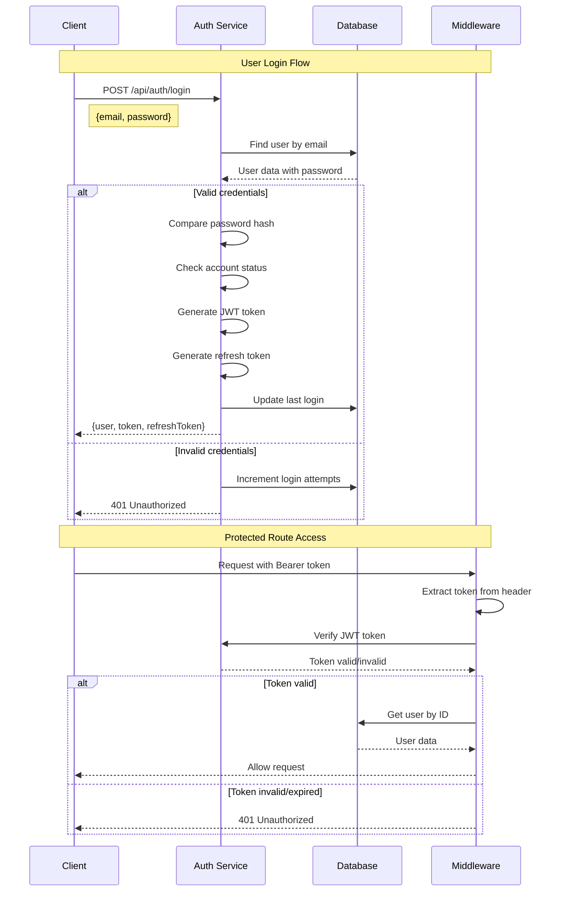
```mermaid
sequenceDiagram
    participant C as Client
    participant A as Auth Service
    participant DB as Database
    participant M as Middleware
    
    Note over C,M: User Login Flow
    C->>A: POST /api/auth/login
    Note right of C: {email, password}
    
    A->>DB: Find user by email
    DB-->>A: User data with password
    
    alt Valid credentials
        A->>A: Compare password hash
        A->>A: Check account status
        A->>A: Generate JWT token
        A->>A: Generate refresh token
        A->>DB: Update last login
        A-->>C: {user, token, refreshToken}
    else Invalid credentials
        A->>DB: Increment login attempts
        A-->>C: 401 Unauthorized
    end
    
    Note over C,M: Protected Route Access
    C->>M: Request with Bearer token
    M->>M: Extract token from header
    M->>A: Verify JWT token
    A-->>M: Token valid/invalid
    
    alt Token valid
        M->>DB: Get user by ID
        DB-->>M: User data
        M-->>C: Allow request
    else Token invalid/expired
        M-->>C: 401 Unauthorized
    end
```

### Token Refresh Flow

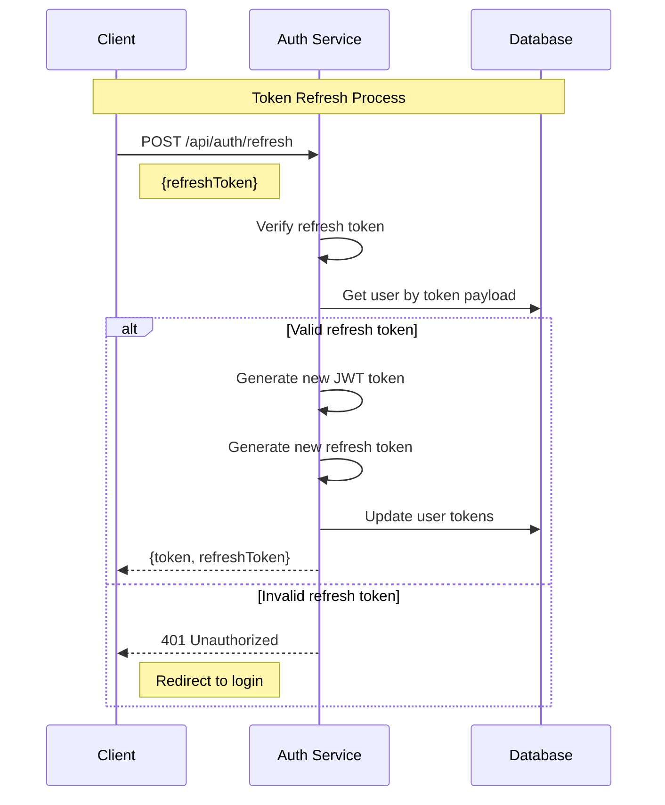
```mermaid
sequenceDiagram
    participant C as Client
    participant A as Auth Service
    participant DB as Database
    
    Note over C,DB: Token Refresh Process
    C->>A: POST /api/auth/refresh
    Note right of C: {refreshToken}
    
    A->>A: Verify refresh token
    A->>DB: Get user by token payload
    
    alt Valid refresh token
        A->>A: Generate new JWT token
        A->>A: Generate new refresh token
        A->>DB: Update user tokens
        A-->>C: {token, refreshToken}
    else Invalid refresh token
        A-->>C: 401 Unauthorized
        Note right of C: Redirect to login
    end
```

### User Registration Flow

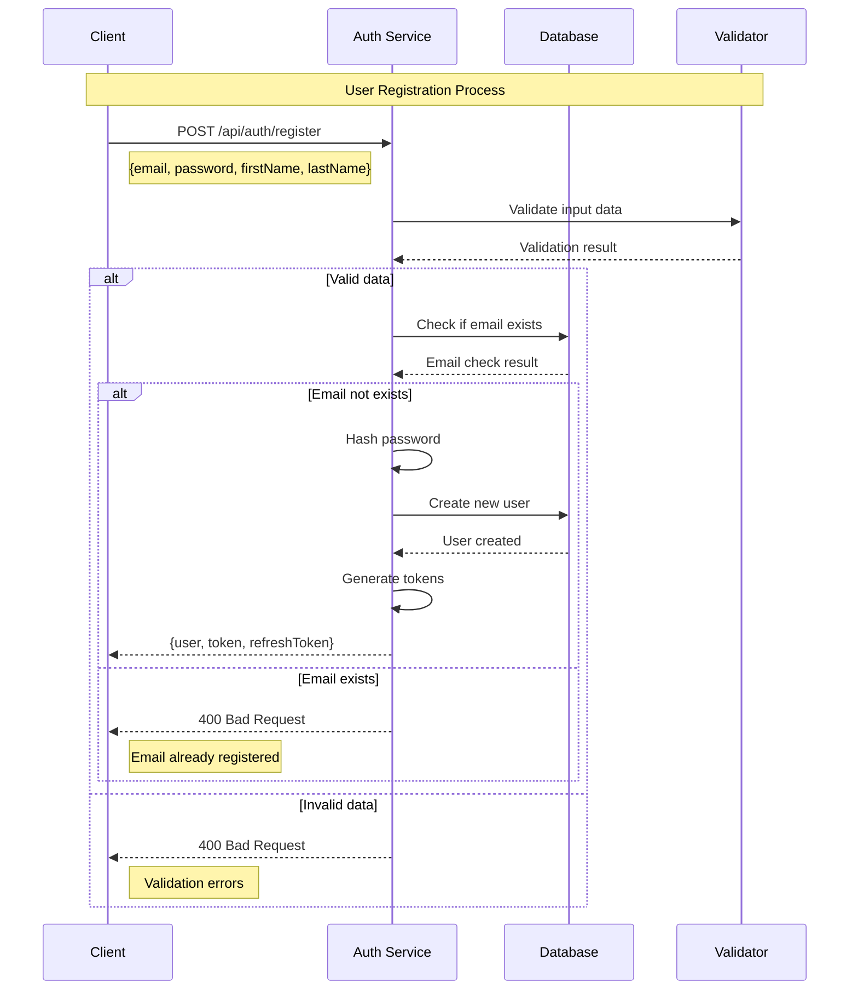
```mermaid
sequenceDiagram
    participant C as Client
    participant A as Auth Service
    participant DB as Database
    participant V as Validator
    
    Note over C,V: User Registration Process
    C->>A: POST /api/auth/register
    Note right of C: {email, password, firstName, lastName}
    
    A->>V: Validate input data
    V-->>A: Validation result
    
    alt Valid data
        A->>DB: Check if email exists
        DB-->>A: Email check result
        
        alt Email not exists
            A->>A: Hash password
            A->>DB: Create new user
            DB-->>A: User created
            A->>A: Generate tokens
            A-->>C: {user, token, refreshToken}
        else Email exists
            A-->>C: 400 Bad Request
            Note right of C: Email already registered
        end
    else Invalid data
        A-->>C: 400 Bad Request
        Note right of C: Validation errors
    end
```

### Password Reset Flow

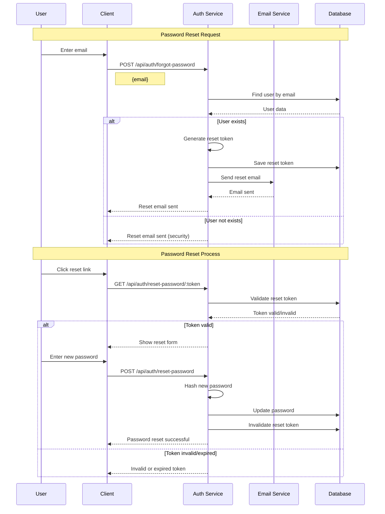
```mermaid
sequenceDiagram
    participant U as User
    participant C as Client
    participant A as Auth Service
    participant E as Email Service
    participant DB as Database
    
    Note over U,DB: Password Reset Request
    U->>C: Enter email
    C->>A: POST /api/auth/forgot-password
    Note right of C: {email}
    
    A->>DB: Find user by email
    DB-->>A: User data
    
    alt User exists
        A->>A: Generate reset token
        A->>DB: Save reset token
        A->>E: Send reset email
        E-->>A: Email sent
        A-->>C: Reset email sent
    else User not exists
        A-->>C: Reset email sent (security)
    end
    
    Note over U,DB: Password Reset Process
    U->>C: Click reset link
    C->>A: GET /api/auth/reset-password/:token
    A->>DB: Validate reset token
    DB-->>A: Token valid/invalid
    
    alt Token valid
        A-->>C: Show reset form
        U->>C: Enter new password
        C->>A: POST /api/auth/reset-password
        A->>A: Hash new password
        A->>DB: Update password
        A->>DB: Invalidate reset token
        A-->>C: Password reset successful
    else Token invalid/expired
        A-->>C: Invalid or expired token
    end
```

## 🎨 Frontend State Management Diyagramları

### Authentication State Flow

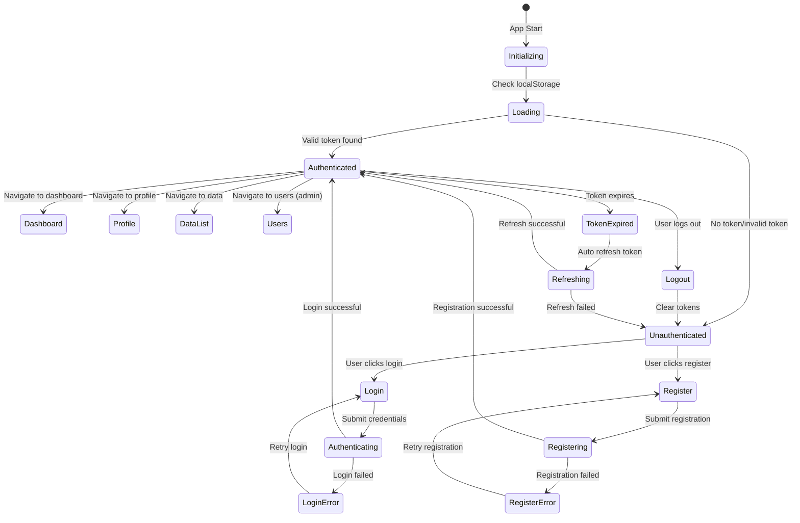
```mermaid
stateDiagram-v2
    [*] --> Initializing: App Start
    
    Initializing --> Loading: Check localStorage
    Loading --> Authenticated: Valid token found
    Loading --> Unauthenticated: No token/invalid token
    
    Unauthenticated --> Login: User clicks login
    Unauthenticated --> Register: User clicks register
    
    Login --> Authenticating: Submit credentials
    Authenticating --> Authenticated: Login successful
    Authenticating --> LoginError: Login failed
    LoginError --> Login: Retry login
    
    Register --> Registering: Submit registration
    Registering --> Authenticated: Registration successful
    Registering --> RegisterError: Registration failed
    RegisterError --> Register: Retry registration
    
    Authenticated --> Dashboard: Navigate to dashboard
    Authenticated --> Profile: Navigate to profile
    Authenticated --> DataList: Navigate to data
    Authenticated --> Users: Navigate to users (admin)
    
    Authenticated --> Logout: User logs out
    Logout --> Unauthenticated: Clear tokens
    
    Authenticated --> TokenExpired: Token expires
    TokenExpired --> Refreshing: Auto refresh token
    Refreshing --> Authenticated: Refresh successful
    Refreshing --> Unauthenticated: Refresh failed
```

### Component State Management

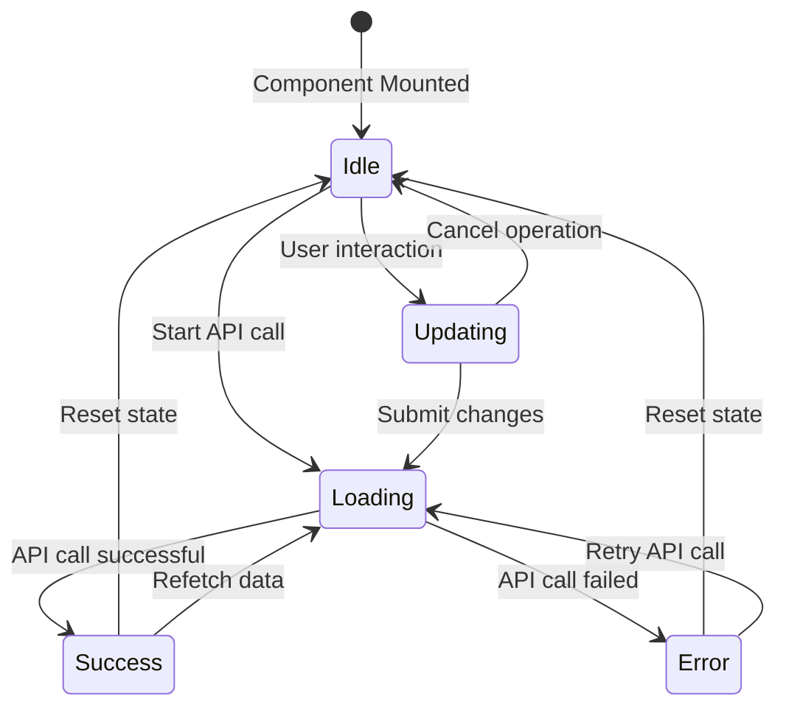
```mermaid
stateDiagram-v2
    [*] --> Idle: Component Mounted
    
    Idle --> Loading: Start API call
    Loading --> Success: API call successful
    Loading --> Error: API call failed
    
    Success --> Idle: Reset state
    Success --> Loading: Refetch data
    
    Error --> Idle: Reset state
    Error --> Loading: Retry API call
    
    Idle --> Updating: User interaction
    Updating --> Loading: Submit changes
    Updating --> Idle: Cancel operation
```

### Navigation State Flow

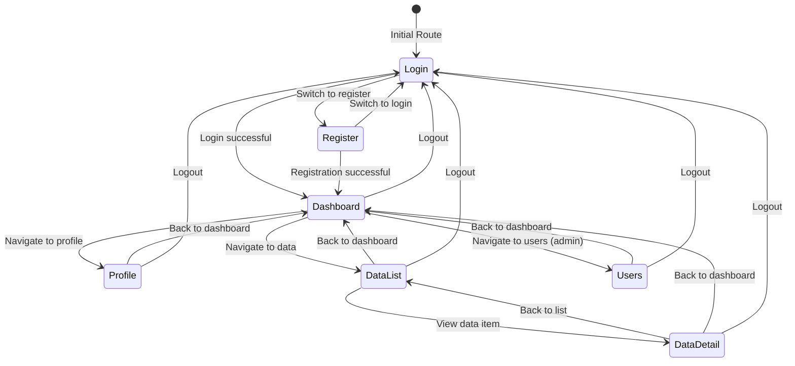
```mermaid
stateDiagram-v2
    [*] --> Login: Initial Route
    
    Login --> Register: Switch to register
    Login --> Dashboard: Login successful
    
    Register --> Login: Switch to login
    Register --> Dashboard: Registration successful
    
    Dashboard --> Profile: Navigate to profile
    Dashboard --> DataList: Navigate to data
    Dashboard --> Users: Navigate to users (admin)
    Dashboard --> Login: Logout
    
    Profile --> Dashboard: Back to dashboard
    Profile --> Login: Logout
    
    DataList --> DataDetail: View data item
    DataList --> Dashboard: Back to dashboard
    DataList --> Login: Logout
    
    DataDetail --> DataList: Back to list
    DataDetail --> Dashboard: Back to dashboard
    DataDetail --> Login: Logout
    
    Users --> Dashboard: Back to dashboard
    Users --> Login: Logout
```

### Form State Management

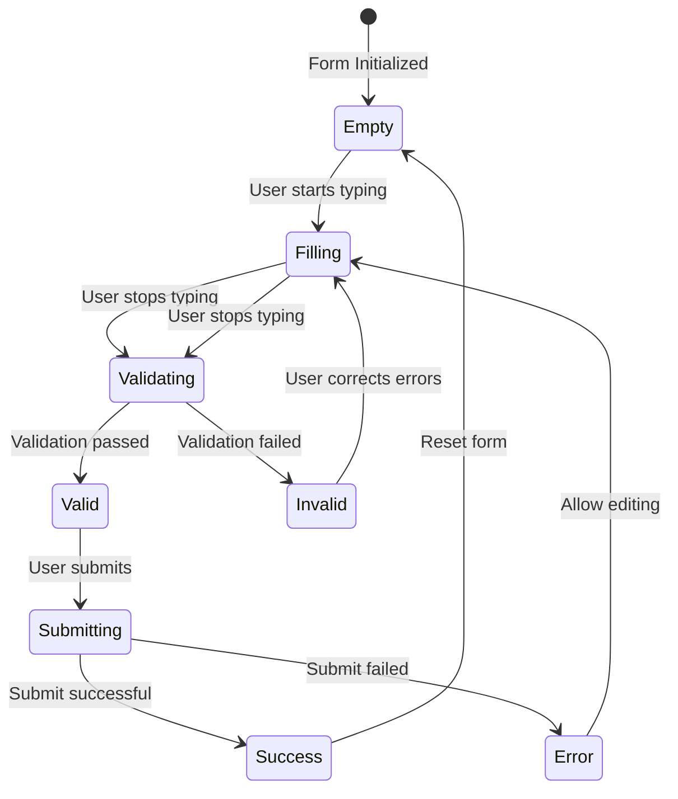
```mermaid
stateDiagram-v2
    [*] --> Empty: Form Initialized
    
    Empty --> Filling: User starts typing
    Filling --> Validating: User stops typing
    Validating --> Valid: Validation passed
    Validating --> Invalid: Validation failed
    
    Valid --> Submitting: User submits
    Submitting --> Success: Submit successful
    Submitting --> Error: Submit failed
    
    Success --> Empty: Reset form
    Error --> Filling: Allow editing
    
    Invalid --> Filling: User corrects errors
    Filling --> Validating: User stops typing
```

## 🔄 API Request/Response Flow

### HTTP Request Interceptor Flow

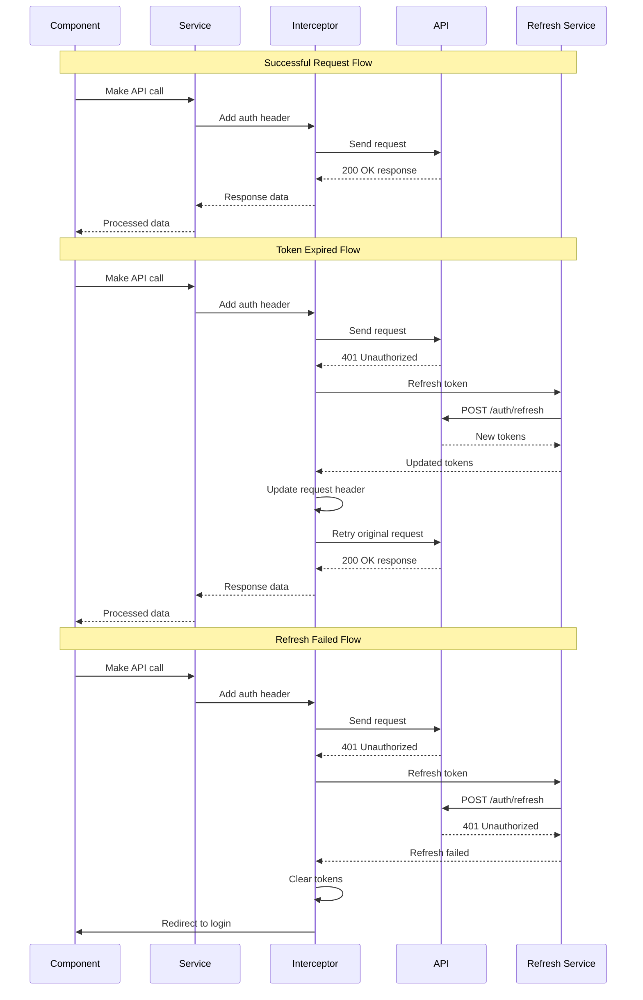
```mermaid
sequenceDiagram
    participant C as Component
    participant S as Service
    participant I as Interceptor
    participant A as API
    participant R as Refresh Service
    
    Note over C,R: Successful Request Flow
    C->>S: Make API call
    S->>I: Add auth header
    I->>A: Send request
    A-->>I: 200 OK response
    I-->>S: Response data
    S-->>C: Processed data
    
    Note over C,R: Token Expired Flow
    C->>S: Make API call
    S->>I: Add auth header
    I->>A: Send request
    A-->>I: 401 Unauthorized
    
    I->>R: Refresh token
    R->>A: POST /auth/refresh
    A-->>R: New tokens
    
    R-->>I: Updated tokens
    I->>I: Update request header
    I->>A: Retry original request
    A-->>I: 200 OK response
    I-->>S: Response data
    S-->>C: Processed data
    
    Note over C,R: Refresh Failed Flow
    C->>S: Make API call
    S->>I: Add auth header
    I->>A: Send request
    A-->>I: 401 Unauthorized
    
    I->>R: Refresh token
    R->>A: POST /auth/refresh
    A-->>R: 401 Unauthorized
    
    R-->>I: Refresh failed
    I->>I: Clear tokens
    I->>C: Redirect to login
```

### Error Handling Flow

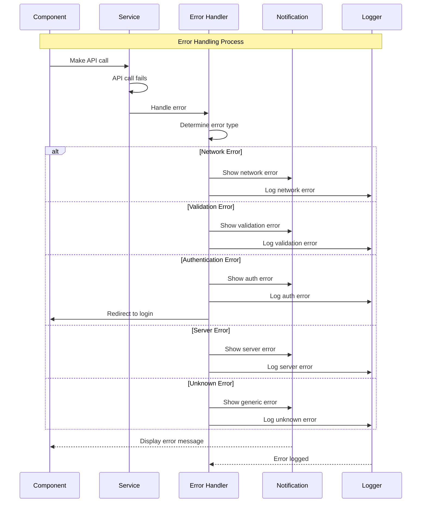
```mermaid
sequenceDiagram
    participant C as Component
    participant S as Service
    participant E as Error Handler
    participant N as Notification
    participant L as Logger
    
    Note over C,L: Error Handling Process
    C->>S: Make API call
    S->>S: API call fails
    
    S->>E: Handle error
    E->>E: Determine error type
    
    alt Network Error
        E->>N: Show network error
        E->>L: Log network error
    else Validation Error
        E->>N: Show validation error
        E->>L: Log validation error
    else Authentication Error
        E->>N: Show auth error
        E->>L: Log auth error
        E->>C: Redirect to login
    else Server Error
        E->>N: Show server error
        E->>L: Log server error
    else Unknown Error
        E->>N: Show generic error
        E->>L: Log unknown error
    end
    
    N-->>C: Display error message
    L-->>E: Error logged
```

## 🗄️ Database Operations Flow

### CRUD Operations Flow

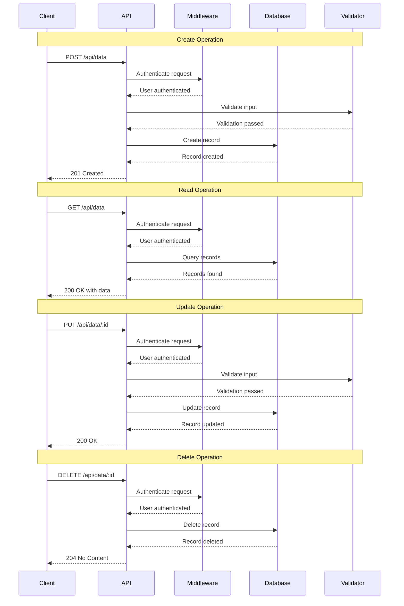
```mermaid
sequenceDiagram
    participant C as Client
    participant A as API
    participant M as Middleware
    participant DB as Database
    participant V as Validator
    
    Note over C,V: Create Operation
    C->>A: POST /api/data
    A->>M: Authenticate request
    M-->>A: User authenticated
    A->>V: Validate input
    V-->>A: Validation passed
    A->>DB: Create record
    DB-->>A: Record created
    A-->>C: 201 Created
    
    Note over C,V: Read Operation
    C->>A: GET /api/data
    A->>M: Authenticate request
    M-->>A: User authenticated
    A->>DB: Query records
    DB-->>A: Records found
    A-->>C: 200 OK with data
    
    Note over C,V: Update Operation
    C->>A: PUT /api/data/:id
    A->>M: Authenticate request
    M-->>A: User authenticated
    A->>V: Validate input
    V-->>A: Validation passed
    A->>DB: Update record
    DB-->>A: Record updated
    A-->>C: 200 OK
    
    Note over C,V: Delete Operation
    C->>A: DELETE /api/data/:id
    A->>M: Authenticate request
    M-->>A: User authenticated
    A->>DB: Delete record
    DB-->>A: Record deleted
    A-->>C: 204 No Content
```

### Database Transaction Flow

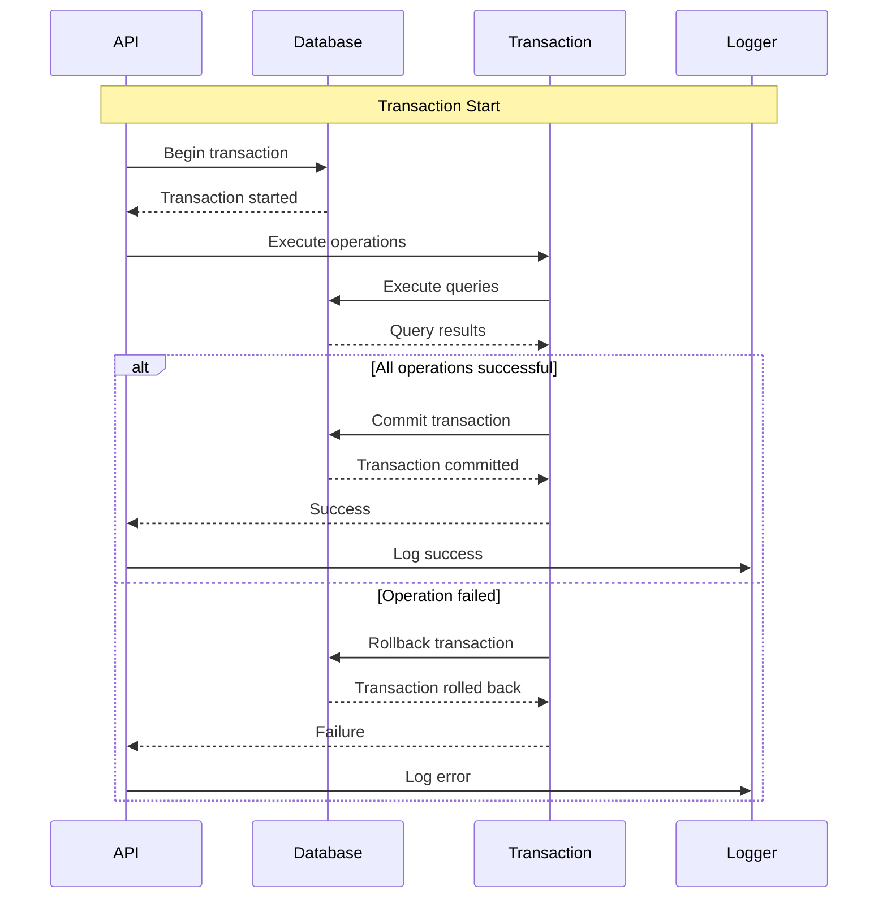
```mermaid
sequenceDiagram
    participant A as API
    participant DB as Database
    participant T as Transaction
    participant L as Logger
    
    Note over A,L: Transaction Start
    A->>DB: Begin transaction
    DB-->>A: Transaction started
    
    A->>T: Execute operations
    T->>DB: Execute queries
    DB-->>T: Query results
    
    alt All operations successful
        T->>DB: Commit transaction
        DB-->>T: Transaction committed
        T-->>A: Success
        A->>L: Log success
    else Operation failed
        T->>DB: Rollback transaction
        DB-->>T: Transaction rolled back
        T-->>A: Failure
        A->>L: Log error
    end
```

## 🔐 Security Flow Diyagramları

### JWT Token Lifecycle

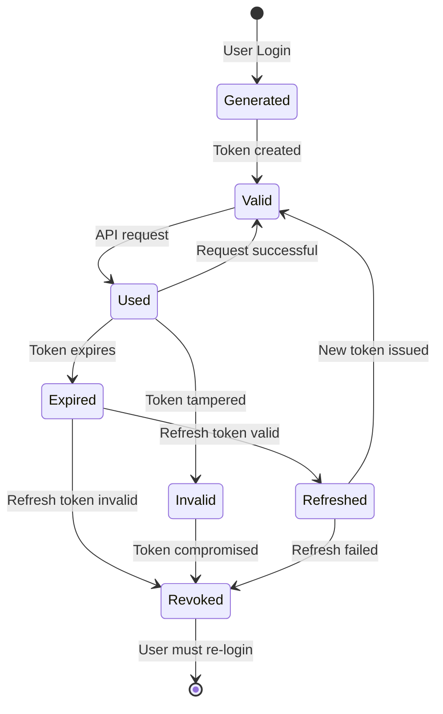
```mermaid
stateDiagram-v2
    [*] --> Generated: User Login
    
    Generated --> Valid: Token created
    Valid --> Used: API request
    Used --> Valid: Request successful
    Used --> Expired: Token expires
    Used --> Invalid: Token tampered
    
    Expired --> Refreshed: Refresh token valid
    Expired --> Revoked: Refresh token invalid
    
    Invalid --> Revoked: Token compromised
    Revoked --> [*]: User must re-login
    
    Refreshed --> Valid: New token issued
    Refreshed --> Revoked: Refresh failed
```

### Password Security Flow

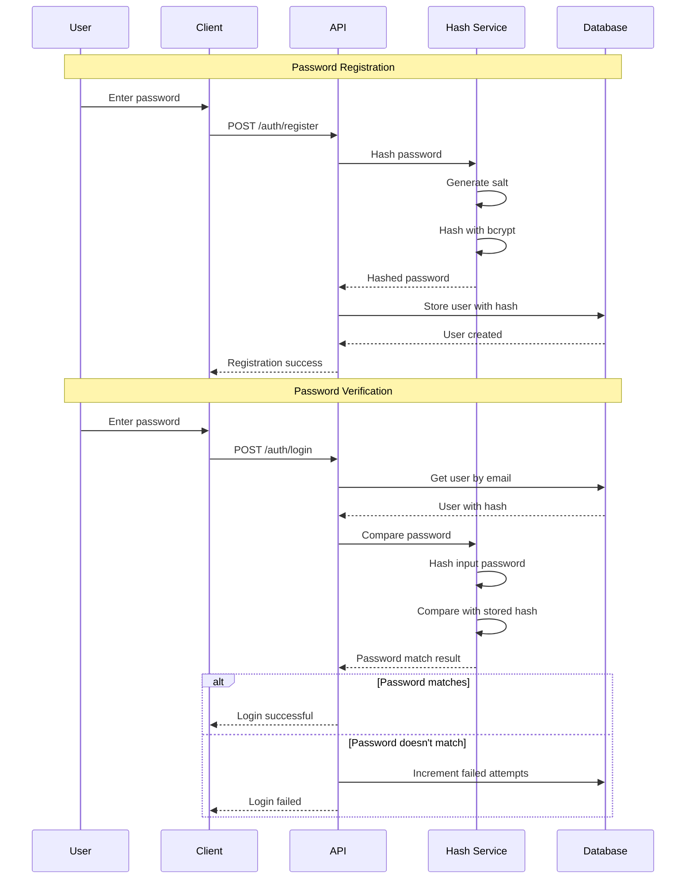
```mermaid
sequenceDiagram
    participant U as User
    participant C as Client
    participant A as API
    participant H as Hash Service
    participant DB as Database
    
    Note over U,DB: Password Registration
    U->>C: Enter password
    C->>A: POST /auth/register
    A->>H: Hash password
    H->>H: Generate salt
    H->>H: Hash with bcrypt
    H-->>A: Hashed password
    A->>DB: Store user with hash
    DB-->>A: User created
    A-->>C: Registration success
    
    Note over U,DB: Password Verification
    U->>C: Enter password
    C->>A: POST /auth/login
    A->>DB: Get user by email
    DB-->>A: User with hash
    A->>H: Compare password
    H->>H: Hash input password
    H->>H: Compare with stored hash
    H-->>A: Password match result
    
    alt Password matches
        A-->>C: Login successful
    else Password doesn't match
        A->>DB: Increment failed attempts
        A-->>C: Login failed
    end
```

### Rate Limiting Flow

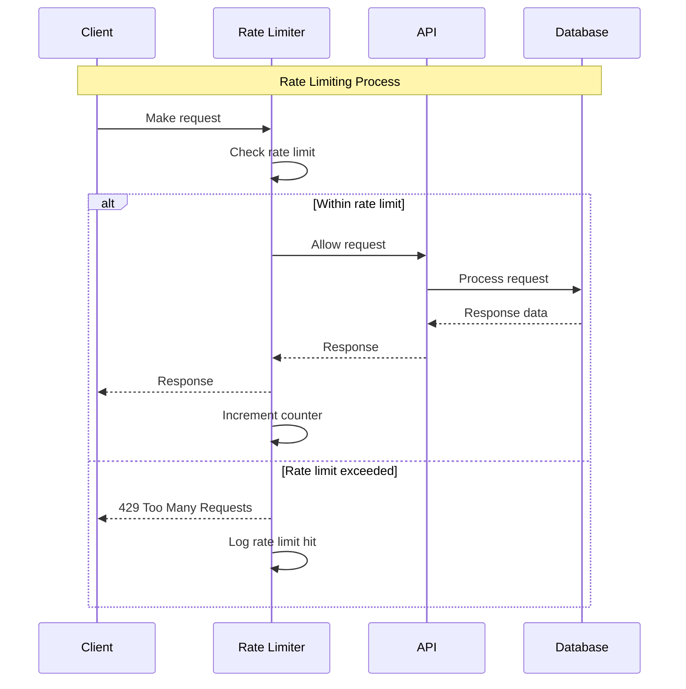
```mermaid
sequenceDiagram
    participant C as Client
    participant R as Rate Limiter
    participant A as API
    participant DB as Database
    
    Note over C,DB: Rate Limiting Process
    C->>R: Make request
    R->>R: Check rate limit
    
    alt Within rate limit
        R->>A: Allow request
        A->>DB: Process request
        DB-->>A: Response data
        A-->>R: Response
        R-->>C: Response
        R->>R: Increment counter
    else Rate limit exceeded
        R-->>C: 429 Too Many Requests
        R->>R: Log rate limit hit
    end
```

## 📱 Mobile App State Flow

### Mobile Navigation State

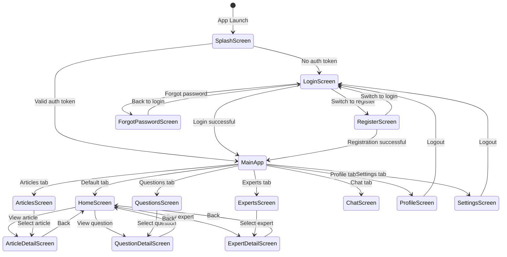
```mermaid
stateDiagram-v2
    [*] --> SplashScreen: App Launch
    
    SplashScreen --> LoginScreen: No auth token
    SplashScreen --> MainApp: Valid auth token
    
    LoginScreen --> RegisterScreen: Switch to register
    LoginScreen --> MainApp: Login successful
    LoginScreen --> ForgotPasswordScreen: Forgot password
    
    RegisterScreen --> LoginScreen: Switch to login
    RegisterScreen --> MainApp: Registration successful
    
    ForgotPasswordScreen --> LoginScreen: Back to login
    
    MainApp --> HomeScreen: Default tab
    MainApp --> ArticlesScreen: Articles tab
    MainApp --> QuestionsScreen: Questions tab
    MainApp --> ExpertsScreen: Experts tab
    MainApp --> ChatScreen: Chat tab
    MainApp --> ProfileScreen: Profile tab
    MainApp --> SettingsScreen: Settings tab
    
    HomeScreen --> ArticleDetailScreen: View article
    HomeScreen --> QuestionDetailScreen: View question
    HomeScreen --> ExpertDetailScreen: View expert
    
    ArticlesScreen --> ArticleDetailScreen: Select article
    QuestionsScreen --> QuestionDetailScreen: Select question
    ExpertsScreen --> ExpertDetailScreen: Select expert
    
    ArticleDetailScreen --> HomeScreen: Back
    QuestionDetailScreen --> HomeScreen: Back
    ExpertDetailScreen --> HomeScreen: Back
    
    ProfileScreen --> LoginScreen: Logout
    SettingsScreen --> LoginScreen: Logout
```

### Mobile Authentication State

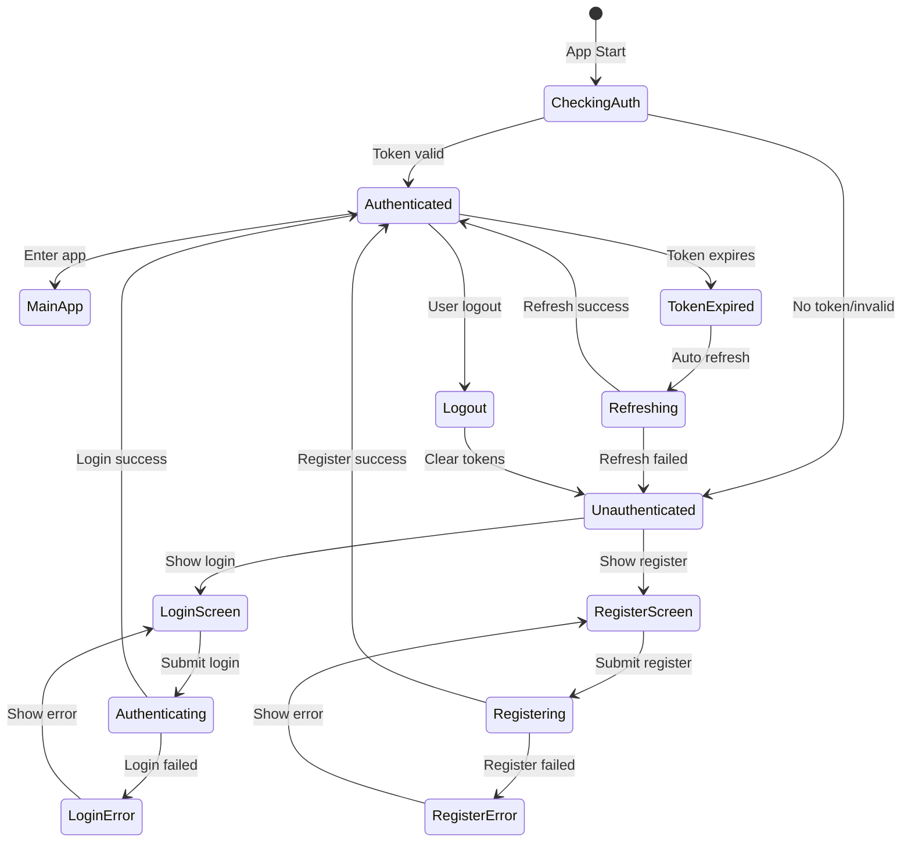
```mermaid
stateDiagram-v2
    [*] --> CheckingAuth: App Start
    
    CheckingAuth --> Authenticated: Token valid
    CheckingAuth --> Unauthenticated: No token/invalid
    
    Unauthenticated --> LoginScreen: Show login
    Unauthenticated --> RegisterScreen: Show register
    
    LoginScreen --> Authenticating: Submit login
    Authenticating --> Authenticated: Login success
    Authenticating --> LoginError: Login failed
    LoginError --> LoginScreen: Show error
    
    RegisterScreen --> Registering: Submit register
    Registering --> Authenticated: Register success
    Registering --> RegisterError: Register failed
    RegisterError --> RegisterScreen: Show error
    
    Authenticated --> MainApp: Enter app
    Authenticated --> TokenExpired: Token expires
    TokenExpired --> Refreshing: Auto refresh
    Refreshing --> Authenticated: Refresh success
    Refreshing --> Unauthenticated: Refresh failed
    
    Authenticated --> Logout: User logout
    Logout --> Unauthenticated: Clear tokens
```

### Mobile Offline State

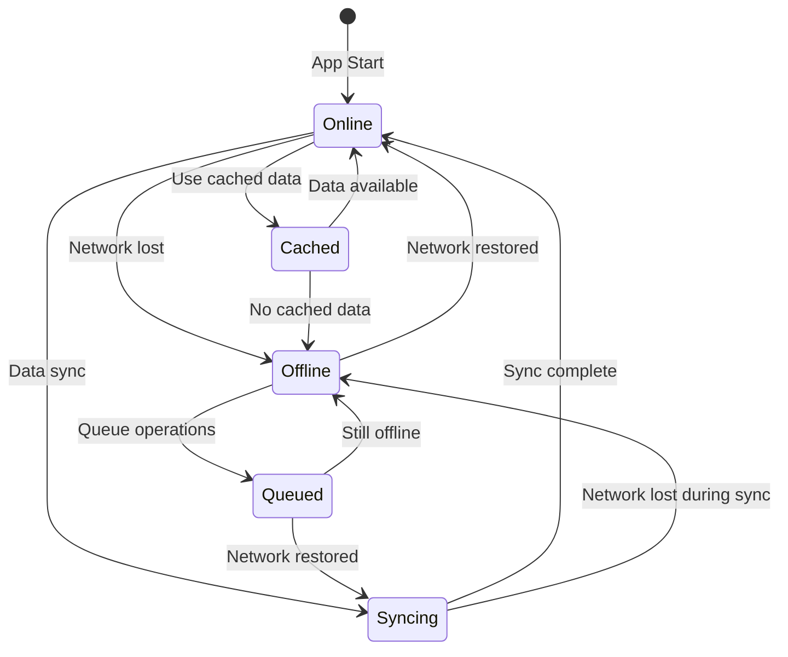
```mermaid
stateDiagram-v2
    [*] --> Online: App Start
    
    Online --> Offline: Network lost
    Offline --> Online: Network restored
    
    Online --> Syncing: Data sync
    Syncing --> Online: Sync complete
    Syncing --> Offline: Network lost during sync
    
    Offline --> Queued: Queue operations
    Queued --> Syncing: Network restored
    Queued --> Offline: Still offline
    
    Online --> Cached: Use cached data
    Cached --> Online: Data available
    Cached --> Offline: No cached data
```

## 🔄 Real-time Communication Flow

### WebSocket Connection Flow

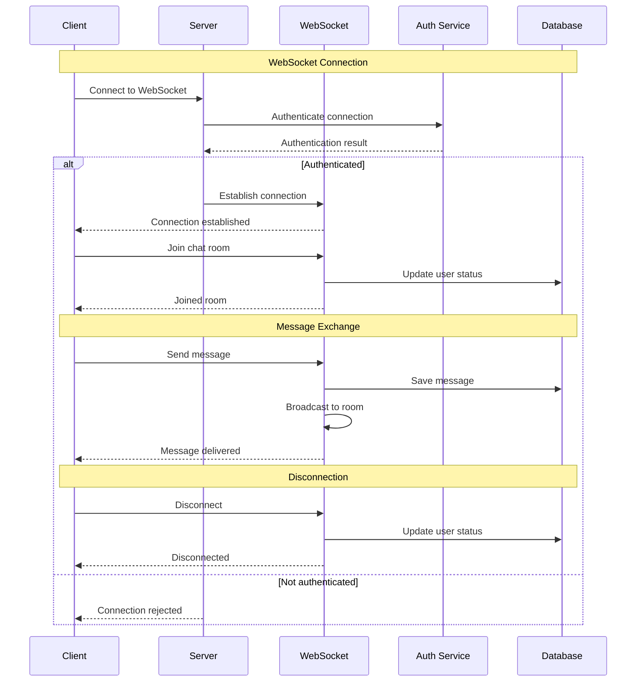
```mermaid
sequenceDiagram
    participant C as Client
    participant S as Server
    participant WS as WebSocket
    participant A as Auth Service
    participant DB as Database
    
    Note over C,DB: WebSocket Connection
    C->>S: Connect to WebSocket
    S->>A: Authenticate connection
    A-->>S: Authentication result
    
    alt Authenticated
        S->>WS: Establish connection
        WS-->>C: Connection established
        C->>WS: Join chat room
        WS->>DB: Update user status
        WS-->>C: Joined room
        
        Note over C,DB: Message Exchange
        C->>WS: Send message
        WS->>DB: Save message
        WS->>WS: Broadcast to room
        WS-->>C: Message delivered
        
        Note over C,DB: Disconnection
        C->>WS: Disconnect
        WS->>DB: Update user status
        WS-->>C: Disconnected
    else Not authenticated
        S-->>C: Connection rejected
    end
```

### Real-time Notification Flow

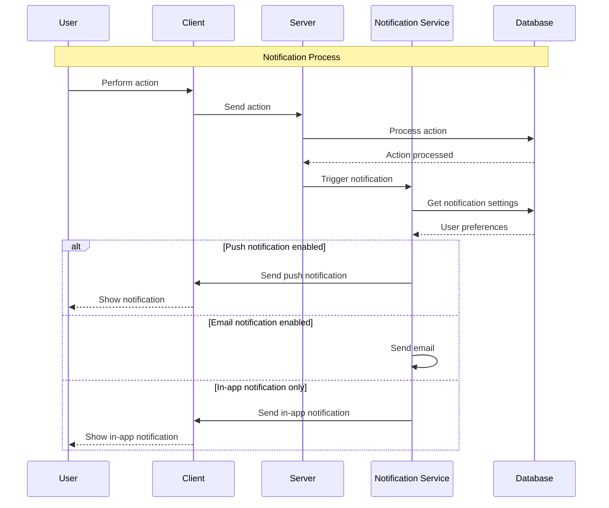
```mermaid
sequenceDiagram
    participant U as User
    participant C as Client
    participant S as Server
    participant N as Notification Service
    participant DB as Database
    
    Note over U,DB: Notification Process
    U->>C: Perform action
    C->>S: Send action
    S->>DB: Process action
    DB-->>S: Action processed
    
    S->>N: Trigger notification
    N->>DB: Get notification settings
    DB-->>N: User preferences
    
    alt Push notification enabled
        N->>C: Send push notification
        C-->>U: Show notification
    else Email notification enabled
        N->>N: Send email
    else In-app notification only
        N->>C: Send in-app notification
        C-->>U: Show in-app notification
    end
```

## 🔄 Data Synchronization Flow

### Client-Server Sync Flow

```mermaid
sequenceDiagram
    participant C as Client
    participant S as Server
    participant DB as Database
    participant CACHE as Cache
    
    Note over C,CACHE: Data Synchronization
    C->>S: Request data
    S->>CACHE: Check cache
    
    alt Cache hit
        CACHE-->>S: Cached data
        S-->>C: Return cached data
    else Cache miss
        S->>DB: Query database
        DB-->>S: Database data
        S->>CACHE: Update cache
        S-->>C: Return data
    end
    
    Note over C,CACHE: Data Update
    C->>S: Update data
    S->>DB: Update database
    DB-->>S: Update successful
    S->>CACHE: Invalidate cache
    S-->>C: Update successful
```

### Conflict Resolution Flow

```mermaid
sequenceDiagram
    participant C1 as Client 1
    participant C2 as Client 2
    participant S as Server
    participant DB as Database
    
    Note over C1,DB: Conflict Resolution
    C1->>S: Update data (version 1)
    C2->>S: Update same data (version 1)
    
    S->>DB: Check version
    DB-->>S: Current version is 1
    
    S->>S: Detect conflict
    S->>S: Apply conflict resolution
    
    alt Last write wins
        S->>DB: Update with last write
        DB-->>S: Update successful
        S-->>C1: Update successful
        S-->>C2: Update successful
    else Merge strategy
        S->>S: Merge changes
        S->>DB: Update merged data
        DB-->>S: Update successful
        S-->>C1: Merged data
        S-->>C2: Merged data
    end
```

## 🎯 Sonuç

Bu dokümanda Fourth platformunun tüm flow ve state diyagramları detaylandırılmıştır. Bu diyagramlar:

### Temel Özellikler
- **Kapsamlı Kapsam**: Backend'den frontend'e tüm akışlar
- **Detaylı Analiz**: Her sürecin adım adım açıklaması
- **Görsel Temsil**: Mermaid ile net ve anlaşılır diyagramlar
- **Teknik Doğruluk**: Gerçek kod yapısına dayalı diyagramlar

### Kapsanan Alanlar
- **Authentication Flow**: Kimlik doğrulama süreçleri
- **State Management**: Frontend state yönetimi
- **API Flow**: Request/response akışları
- **Database Operations**: Veritabanı işlemleri
- **Security Flow**: Güvenlik süreçleri
- **Mobile Flow**: Mobil uygulama akışları
- **Real-time Flow**: Gerçek zamanlı iletişim

Bu diyagramlar, geliştiricilerin sistem mimarisini anlaması ve yeni özellikler eklemesi için rehber niteliğindedir.
