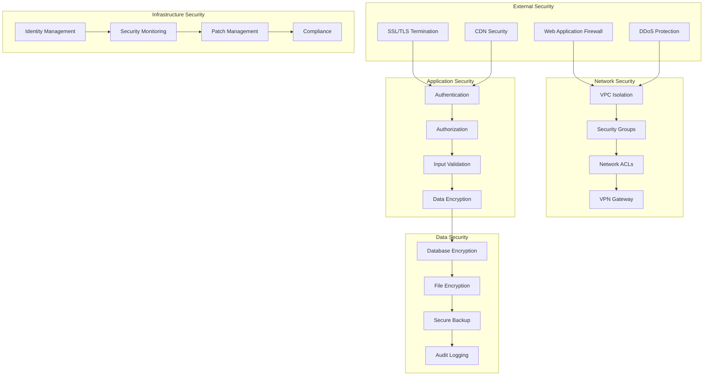
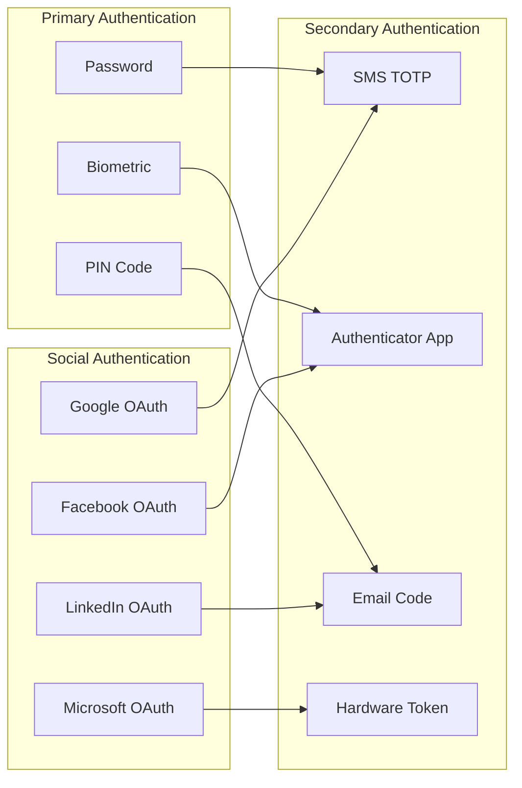
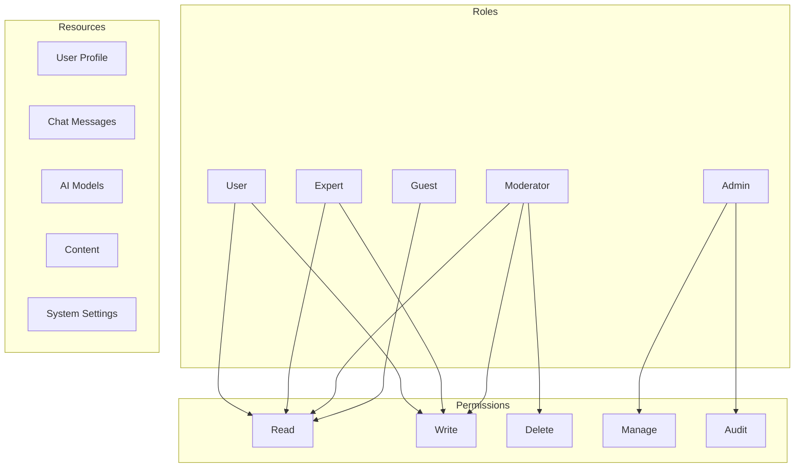
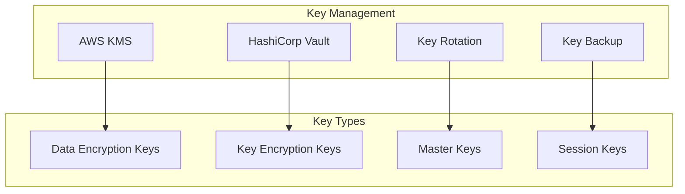
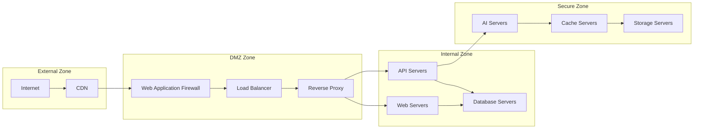
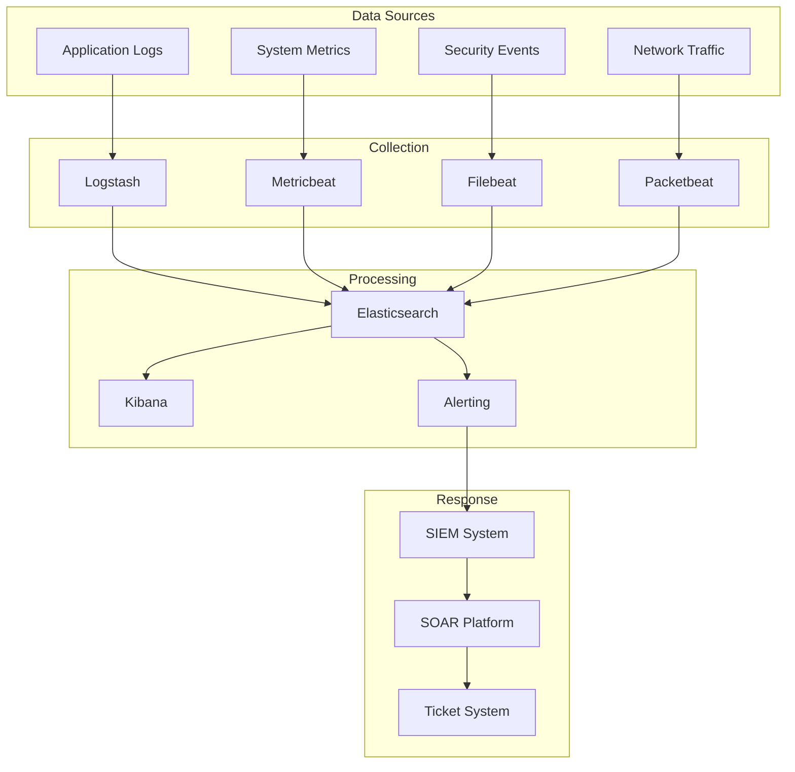
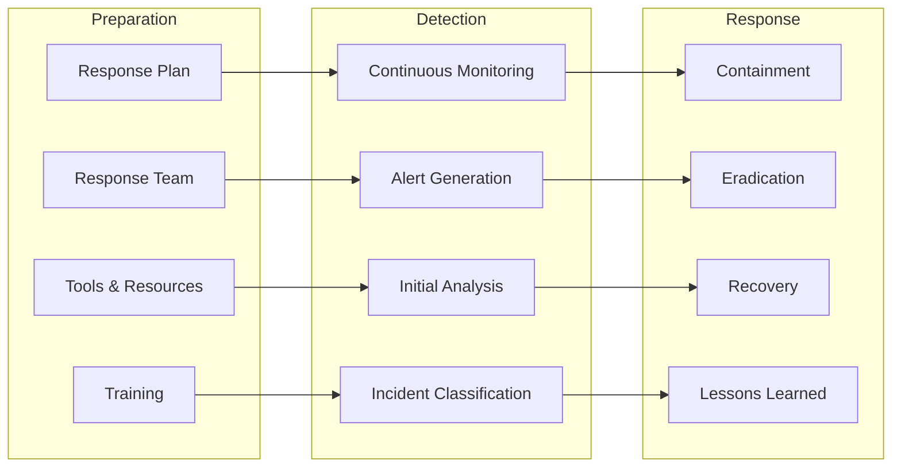

# 🔒 Güvenlik

## Genel Bakış

Fourth platformu, en yüksek güvenlik standartlarını karşılayacak şekilde tasarlanmıştır. Bu dokümanda güvenlik mimarisi, tehdit modelleme, güvenlik kontrolleri ve uyumluluk gereksinimleri detaylandırılmıştır.

## 🛡️ Güvenlik Mimarisi

### Güvenlik Katmanları

## 🔐 Kimlik Doğrulama ve Yetkilendirme

### Authentication (Kimlik Doğrulama)

#### Multi-Factor Authentication (MFA)
- **SMS TOTP**: SMS tabanlı tek kullanımlık şifre
- **Authenticator Apps**: Google Authenticator, Authy
- **Hardware Tokens**: YubiKey, FIDO2
- **Biometric**: Parmak izi, yüz tanıma
- **Email Verification**: E-posta doğrulama

#### Authentication Methods

#### Password Security
- **Minimum Requirements**: 12 karakter, büyük/küçük harf, sayı, özel karakter
- **Password Hashing**: bcrypt (12 rounds)
- **Password History**: Son 12 şifre hatırlama
- **Account Lockout**: 5 başarısız denemeden sonra 15 dakika
- **Password Expiration**: 90 günde bir değişim zorunluluğu

### Authorization (Yetkilendirme)

#### Role-Based Access Control (RBAC)

#### Permission Matrix
| Role | Profile | Chat | AI | Content | System |
|------|---------|------|----|---------|---------|
| **Admin** | CRUD | CRUD | CRUD | CRUD | CRUD |
| **Expert** | RUD | CRUD | R | CRUD | R |
| **User** | RUD | CRUD | R | R | - |
| **Moderator** | R | CRUD | R | CRUD | R |
| **Guest** | R | R | R | R | - |

## 🔒 Veri Güvenliği

### Data Encryption

#### Encryption at Rest
- **Database**: AES-256-GCM encryption
- **File Storage**: AES-256-CBC encryption
- **Backup**: AES-256-GCM encryption
- **Cache**: AES-256-GCM encryption
- **Logs**: AES-256-GCM encryption

#### Encryption in Transit
- **HTTPS**: TLS 1.3 minimum
- **API Calls**: TLS 1.3
- **Database Connections**: TLS 1.3
- **File Transfers**: SFTP/SCP
- **Internal Communication**: mTLS

#### Key Management

### Data Classification

#### Data Sensitivity Levels
1. **Public**: Genel erişilebilir veriler
2. **Internal**: Şirket içi kullanım
3. **Confidential**: Gizli veriler
4. **Restricted**: Kısıtlı erişimli veriler

#### Data Handling Requirements
| Level | Encryption | Access Control | Audit | Retention |
|-------|------------|----------------|-------|-----------|
| **Public** | Optional | Basic | Basic | 1 year |
| **Internal** | Required | Role-based | Standard | 3 years |
| **Confidential** | Required | MFA + Role | Detailed | 7 years |
| **Restricted** | Required | MFA + Role + Approval | Full | 10 years |

### Data Privacy

#### Personal Data Protection
- **Data Minimization**: Sadece gerekli veriler toplanır
- **Purpose Limitation**: Belirli amaçlar için kullanım
- **Storage Limitation**: Belirli süre sonra silme
- **Accuracy**: Veri doğruluğu sağlama
- **Transparency**: Veri kullanımı şeffaflığı

#### User Rights (GDPR)
- **Right to Access**: Veri erişim hakkı
- **Right to Rectification**: Veri düzeltme hakkı
- **Right to Erasure**: Veri silme hakkı
- **Right to Portability**: Veri taşınabilirlik hakkı
- **Right to Object**: Veri işlemeye itiraz hakkı

## 🌐 Ağ Güvenliği

### Network Security Controls

#### Firewall Rules

#### Network Segmentation
- **Public Subnet**: Internet-facing resources
- **Private Subnet**: Internal application servers
- **Database Subnet**: Database servers only
- **Management Subnet**: Administrative access
- **Isolated Subnet**: High-security resources

### DDoS Protection

#### DDoS Mitigation Strategies
- **Rate Limiting**: Request rate limiting
- **Traffic Filtering**: Malicious traffic filtering
- **Geographic Blocking**: Geographic restrictions
- **Behavioral Analysis**: Anomaly detection
- **Auto-scaling**: Automatic resource scaling

#### DDoS Protection Levels
| Level | Description | Mitigation |
|-------|-------------|------------|
| **Level 1** | Basic DDoS | Rate limiting |
| **Level 2** | Medium DDoS | Traffic filtering |
| **Level 3** | Large DDoS | Geographic blocking |
| **Level 4** | Massive DDoS | Cloud provider protection |

## 🔍 Güvenlik İzleme ve Loglama

### Security Monitoring

#### Real-time Monitoring

#### Security Event Types
- **Authentication Events**: Login attempts, MFA failures
- **Authorization Events**: Permission denials, privilege escalations
- **Data Access Events**: Database queries, file access
- **Network Events**: Connection attempts, traffic anomalies
- **System Events**: Configuration changes, service restarts

### Audit Logging

#### Audit Requirements
- **User Actions**: All user activities logged
- **System Changes**: Configuration and code changes
- **Data Access**: Database and file access
- **Administrative Actions**: Admin operations
- **Security Events**: Security-related activities

#### Log Retention
| Log Type | Retention Period | Storage Location |
|----------|------------------|------------------|
| **Authentication** | 2 years | Secure storage |
| **Authorization** | 2 years | Secure storage |
| **Data Access** | 7 years | Encrypted storage |
| **System Events** | 1 year | Standard storage |
| **Security Events** | 10 years | Secure storage |

## 🚨 Incident Response

### Incident Response Plan

#### Response Phases

#### Incident Classification
| Severity | Description | Response Time | Escalation |
|----------|-------------|---------------|------------|
| **Critical** | System compromise | 15 minutes | CISO |
| **High** | Data breach | 1 hour | Security Manager |
| **Medium** | Service disruption | 4 hours | Team Lead |
| **Low** | Minor issues | 24 hours | Standard process |

### Security Incident Types

#### Common Incident Types
- **Malware Infections**: Virus, trojan, ransomware
- **Data Breaches**: Unauthorized data access
- **DDoS Attacks**: Service availability attacks
- **Insider Threats**: Malicious insider activities
- **Social Engineering**: Phishing, pretexting
- **Vulnerability Exploits**: Zero-day attacks

#### Response Procedures
1. **Immediate Response**: Contain the threat
2. **Assessment**: Evaluate the impact
3. **Communication**: Notify stakeholders
4. **Investigation**: Determine root cause
5. **Remediation**: Fix vulnerabilities
6. **Recovery**: Restore normal operations
7. **Documentation**: Record lessons learned

## 📋 Uyumluluk ve Sertifikasyonlar

### Compliance Frameworks

#### GDPR (General Data Protection Regulation)
- **Data Protection Officer**: Appointed DPO
- **Privacy Impact Assessment**: Regular PIAs
- **Data Processing Records**: Comprehensive records
- **User Consent Management**: Granular consent
- **Data Breach Notification**: 72-hour notification

#### HIPAA (Health Insurance Portability and Accountability Act)
- **Administrative Safeguards**: Policies and procedures
- **Physical Safeguards**: Physical access controls
- **Technical Safeguards**: Technical security measures
- **Business Associate Agreements**: Third-party contracts
- **Risk Assessment**: Regular risk assessments

#### SOC 2 Type II
- **Security**: Information security controls
- **Availability**: System availability controls
- **Processing Integrity**: Data processing controls
- **Confidentiality**: Data confidentiality controls
- **Privacy**: Personal information controls

#### ISO 27001
- **Information Security Management System**: ISMS
- **Risk Management**: Information security risk management
- **Security Controls**: 114 security controls
- **Continuous Improvement**: Regular reviews and updates
- **Management Commitment**: Top management support

### Security Certifications

#### Required Certifications
- **CISSP**: Certified Information Systems Security Professional
- **CISM**: Certified Information Security Manager
- **CISA**: Certified Information Systems Auditor
- **CEH**: Certified Ethical Hacker
- **CISSP**: Certified Information Systems Security Professional

#### Platform Certifications
- **ISO 27001**: Information security management
- **SOC 2 Type II**: Security and availability
- **PCI DSS**: Payment card industry compliance
- **FedRAMP**: Federal risk and authorization
- **Common Criteria**: IT security evaluation

## 🔧 Güvenlik Araçları

### Security Tools Stack

#### Vulnerability Management
- **Nessus**: Vulnerability scanning
- **OpenVAS**: Open source vulnerability scanner
- **Qualys**: Cloud-based vulnerability management
- **Rapid7**: Vulnerability management platform
- **Tenable**: Vulnerability assessment

#### Security Information and Event Management (SIEM)
- **Splunk**: Enterprise security platform
- **IBM QRadar**: Security intelligence platform
- **LogRhythm**: Security intelligence platform
- **ArcSight**: Security information management
- **AlienVault**: Unified security management

#### Endpoint Detection and Response (EDR)
- **CrowdStrike**: Endpoint protection platform
- **Carbon Black**: Endpoint detection and response
- **SentinelOne**: Autonomous endpoint protection
- **Microsoft Defender**: Endpoint security
- **Symantec**: Endpoint protection

#### Network Security
- **Palo Alto**: Next-generation firewall
- **Cisco**: Network security appliances
- **Fortinet**: Network security platform
- **Check Point**: Network security solutions
- **Juniper**: Network security products

### Security Testing

#### Penetration Testing
- **OWASP ZAP**: Web application security testing
- **Burp Suite**: Web vulnerability scanner
- **Nmap**: Network discovery and security auditing
- **Metasploit**: Penetration testing framework
- **Nessus**: Vulnerability assessment

#### Code Security Analysis
- **SonarQube**: Code quality and security
- **Checkmarx**: Static application security testing
- **Veracode**: Application security platform
- **Fortify**: Application security testing
- **Snyk**: Developer-first security

#### Infrastructure Security
- **Nessus**: Infrastructure vulnerability scanning
- **OpenSCAP**: Security compliance scanning
- **Lynis**: Security auditing tool
- **Docker Bench**: Container security testing
- **Kubernetes Security**: K8s security scanning

## 📊 Güvenlik Metrikleri

### Key Security Metrics

#### Security Posture Metrics
- **Vulnerability Count**: Open vulnerabilities by severity
- **Patch Compliance**: Percentage of systems patched
- **Security Training**: Employee security training completion
- **Incident Response Time**: Average time to respond
- **Threat Detection Rate**: Percentage of threats detected

#### Risk Metrics
- **Risk Score**: Overall security risk score
- **Threat Level**: Current threat level
- **Exposure Score**: System exposure to threats
- **Compliance Score**: Compliance with security standards
- **Maturity Level**: Security program maturity

#### Performance Metrics
- **False Positive Rate**: Percentage of false alarms
- **Detection Accuracy**: Accuracy of threat detection
- **Response Time**: Time to detect and respond
- **Recovery Time**: Time to recover from incidents
- **Availability**: System availability percentage

### Security Dashboard

#### Executive Dashboard
- **Overall Security Score**: High-level security status
- **Active Threats**: Current security threats
- **Compliance Status**: Regulatory compliance status
- **Incident Summary**: Recent security incidents
- **Risk Trends**: Security risk trends over time

#### Operational Dashboard
- **Security Events**: Real-time security events
- **Vulnerability Status**: Current vulnerability status
- **System Health**: Security system health
- **Performance Metrics**: Security tool performance
- **Alert Status**: Active security alerts

## 🎯 Sonuç

Fourth platformu, en yüksek güvenlik standartlarını karşılayacak şekilde tasarlanmıştır. Bu güvenlik yaklaşımı:

### Temel Prensipler
- **Defense in Depth**: Çok katmanlı güvenlik
- **Zero Trust**: Hiçbir şeye güvenme yaklaşımı
- **Least Privilege**: Minimum yetki prensibi
- **Continuous Monitoring**: Sürekli güvenlik izleme
- **Incident Response**: Hızlı olay müdahalesi

### Güvenlik Avantajları
- **Comprehensive Coverage**: Kapsamlı güvenlik kapsamı
- **Industry Standards**: Endüstri standardı uyumluluk
- **Automated Response**: Otomatik güvenlik yanıtı
- **Continuous Improvement**: Sürekli güvenlik iyileştirmesi
- **User Trust**: Kullanıcı güveni ve gizlilik

Bu güvenlik yaklaşımı, Fourth platformunun güvenilir ve güvenli bir platform olarak konumlanmasını sağlar ve kullanıcıların verilerini en yüksek güvenlik standartlarında korur.
