# 📊 Sistem Mimarisi

## Genel Bakış

Fourth platformu, mikroservis tabanlı, ölçeklenebilir ve güvenli bir mimariye sahiptir. Bu dokümanda sistem mimarisi, bileşenler arası etkileşimler ve veri akışları detaylandırılmıştır.

## 🏗️ Genel Mimari

### Sistem Mimarisi Diyagramı

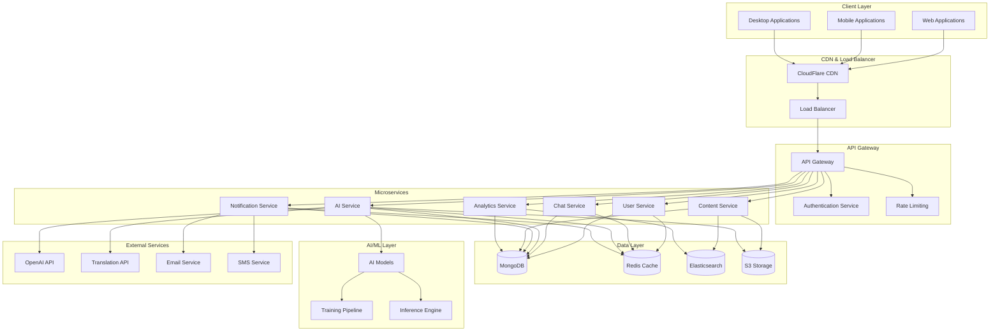

## 🔄 Veri Akışı

### Kullanıcı Etkileşim Akışı

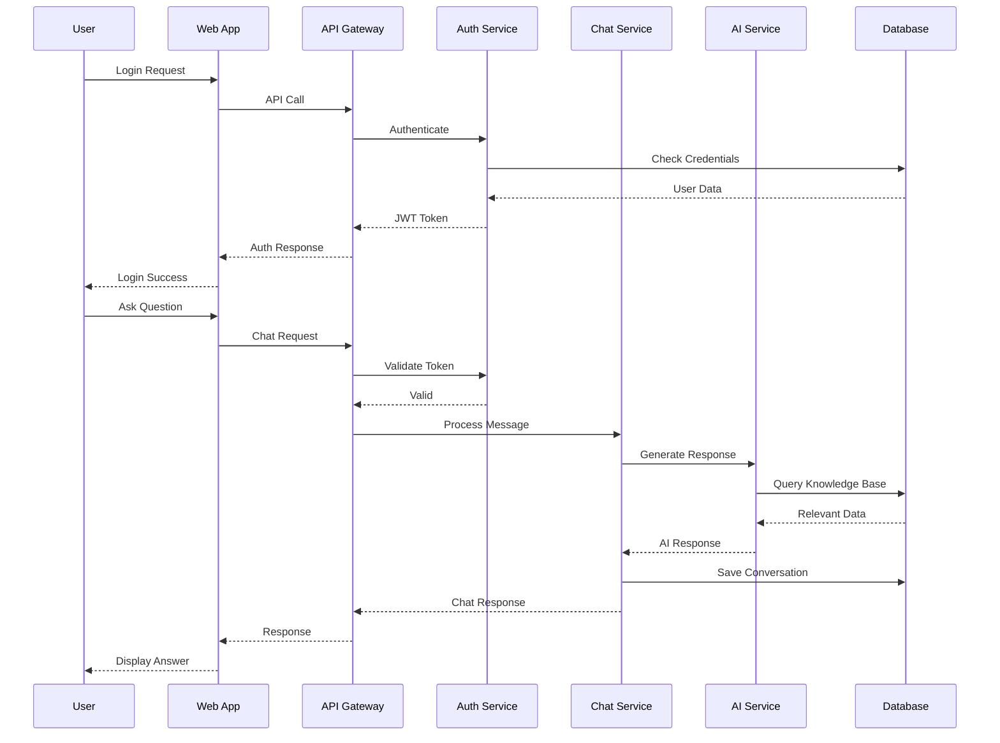

## 🏢 Mikroservis Mimarisi

### Servis Detayları

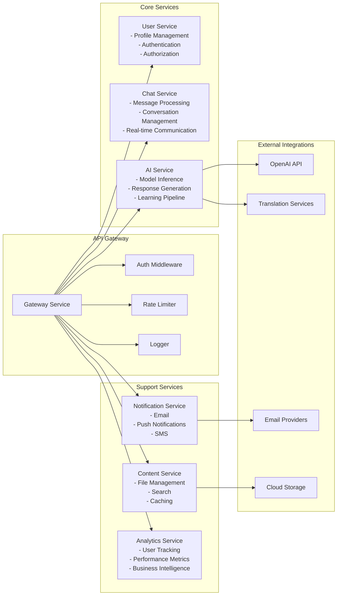

## 🗄️ Veri Mimarisi

### Veritabanı Şeması

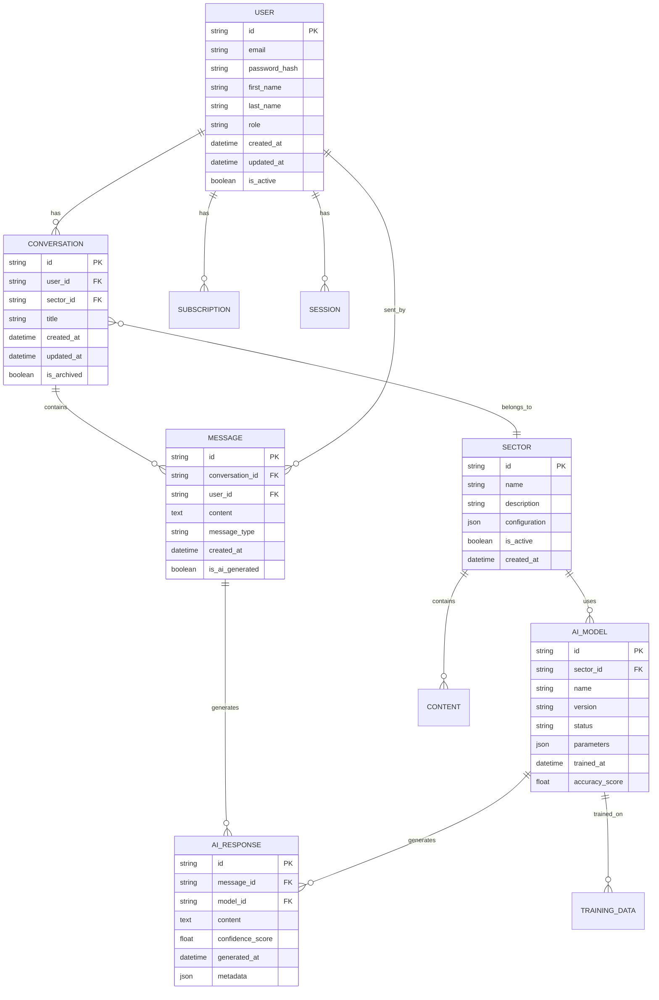

## 🔐 Güvenlik Mimarisi

### Güvenlik Katmanları

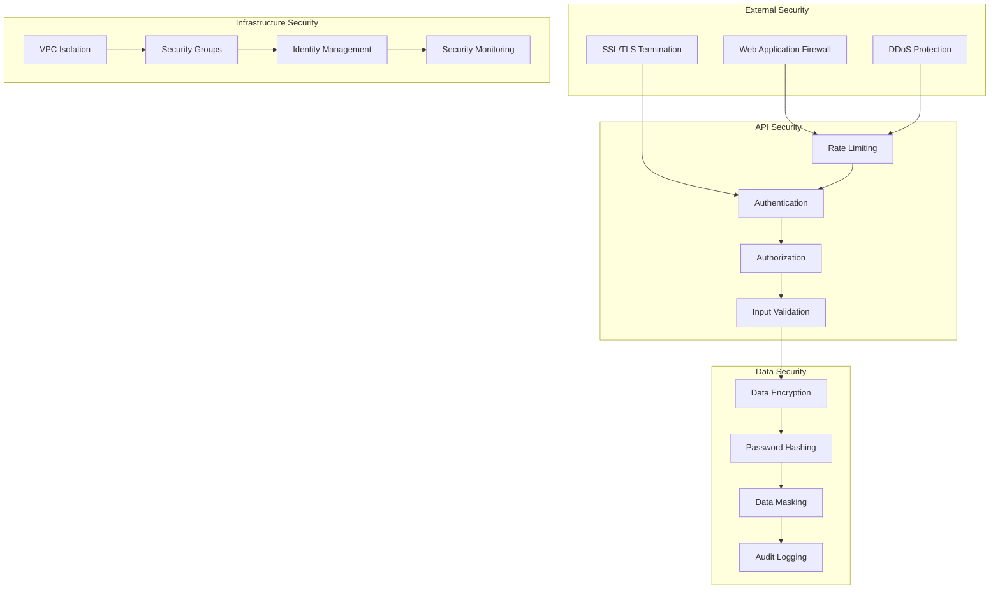

## 📊 Monitoring ve Observability

### Monitoring Mimarisi

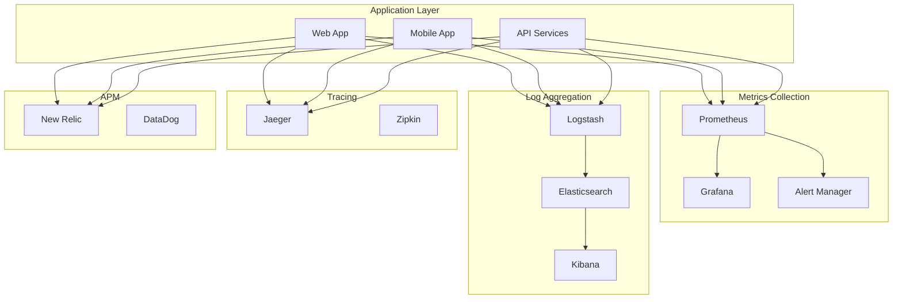

## 🚀 Deployment Mimarisi

### Kubernetes Deployment

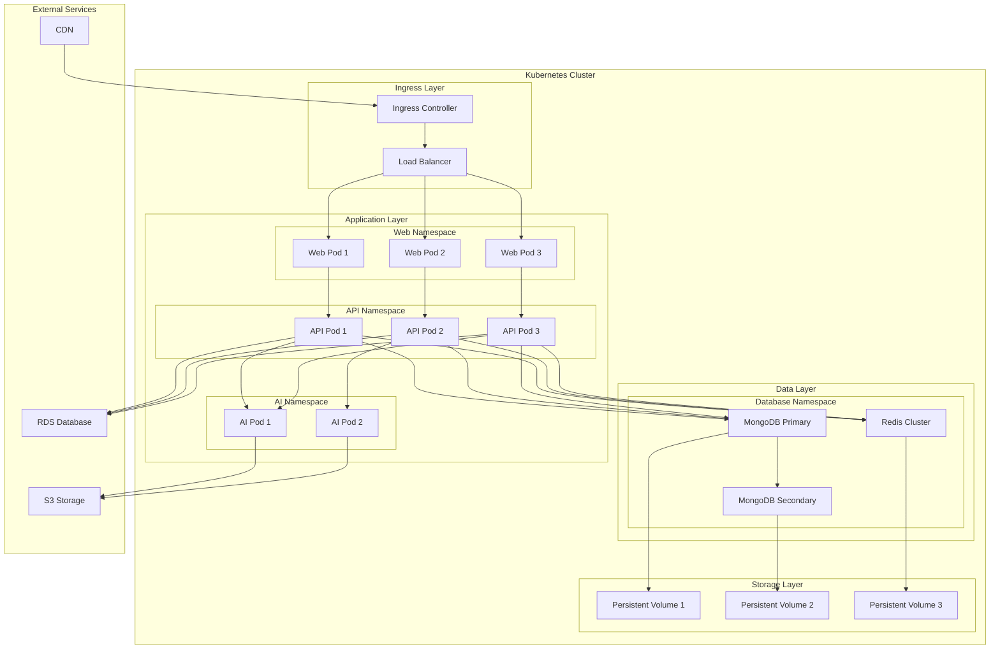

## 🔄 CI/CD Pipeline

### Deployment Pipeline

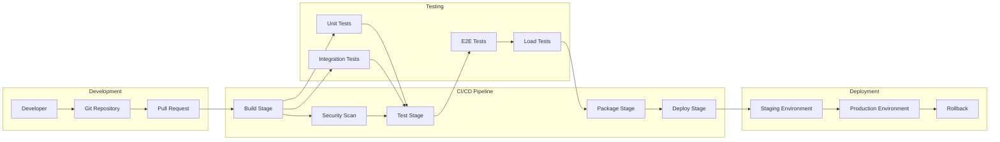

## 🌐 Global Distribution

### Multi-Region Architecture

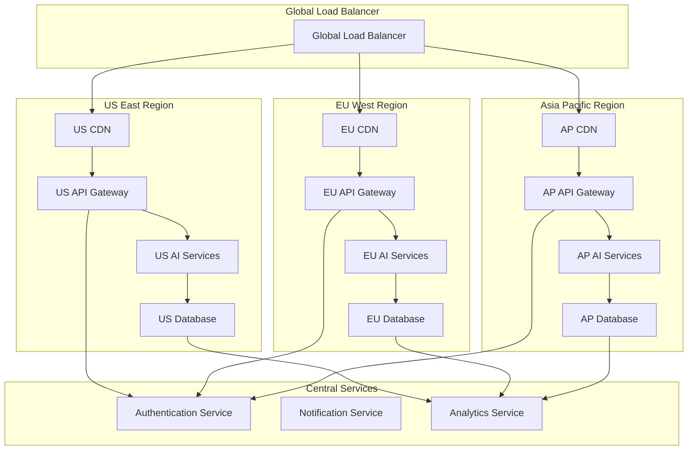

## 🔧 AI/ML Mimarisi

### AI Pipeline

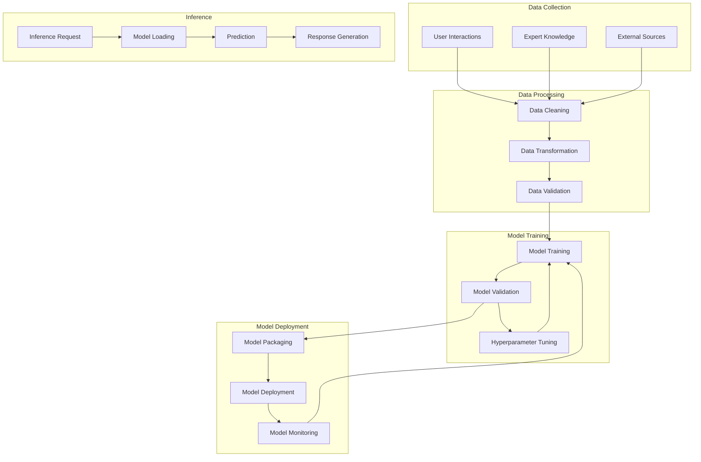

## 📱 Mobile Architecture

### Mobile App Architecture

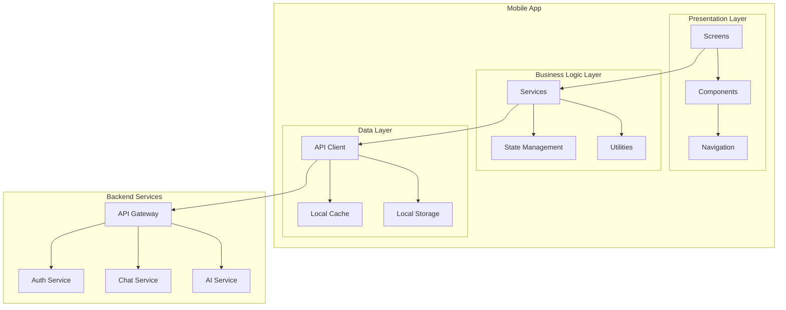

## 🔄 Event-Driven Architecture

### Event Flow

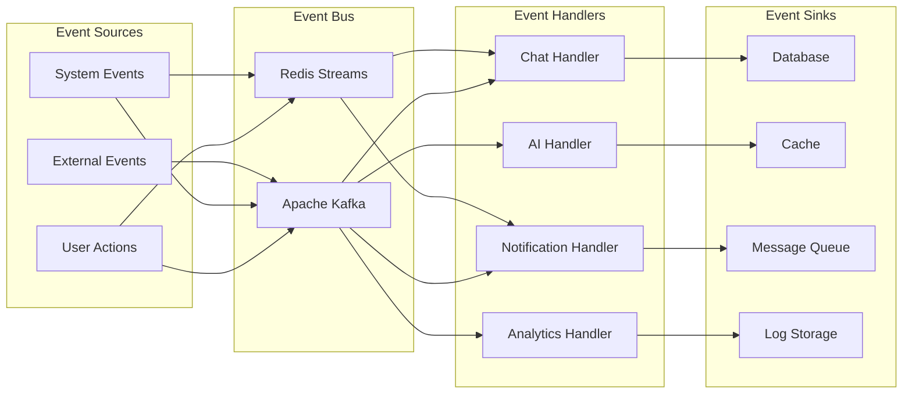

## 🎯 Sonuç

Fourth platformu, modern mikroservis mimarisi prensiplerine dayalı, ölçeklenebilir ve güvenli bir sistem olarak tasarlanmıştır. Bu mimari:

### Temel Özellikler
- **Mikroservis Tabanlı**: Bağımsız, ölçeklenebilir servisler
- **Event-Driven**: Asenkron, esnek iletişim
- **Cloud-Native**: Bulut tabanlı, containerized deployment
- **AI-Integrated**: Yapay zeka destekli akıllı servisler
- **Multi-Region**: Global dağıtım ve yüksek erişilebilirlik

### Teknik Avantajlar
- **Ölçeklenebilirlik**: Horizontal ve vertical scaling
- **Güvenilirlik**: Fault tolerance ve disaster recovery
- **Performans**: Optimized data flow ve caching
- **Güvenlik**: Multi-layer security architecture
- **Observability**: Comprehensive monitoring ve logging

Bu mimari, Fourth platformunun hedeflerini gerçekleştirmek için gerekli tüm bileşenleri sağlar ve gelecekteki geliştirmeler için esnek bir temel oluşturur.
