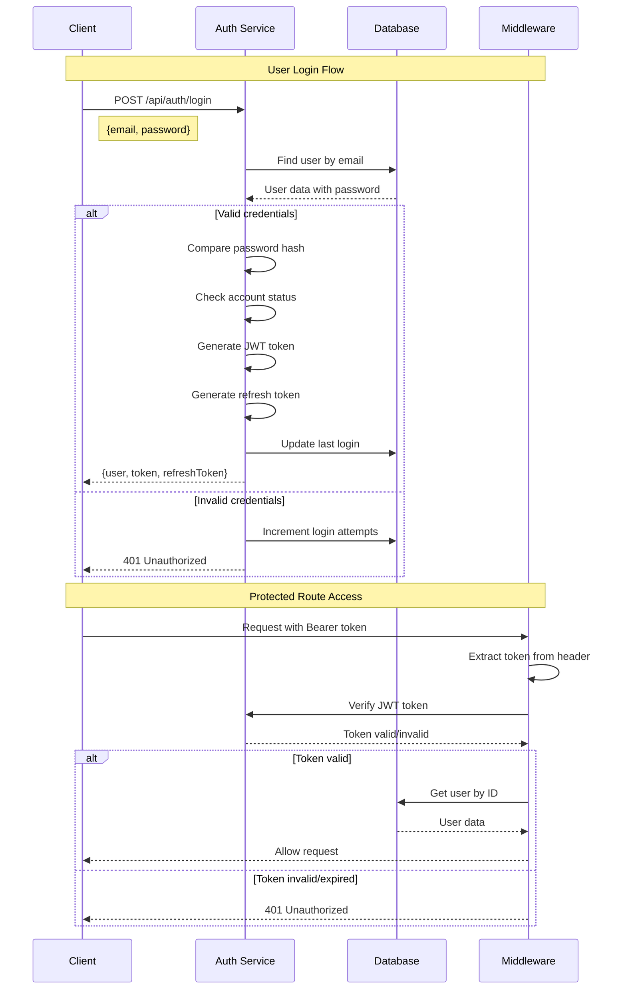
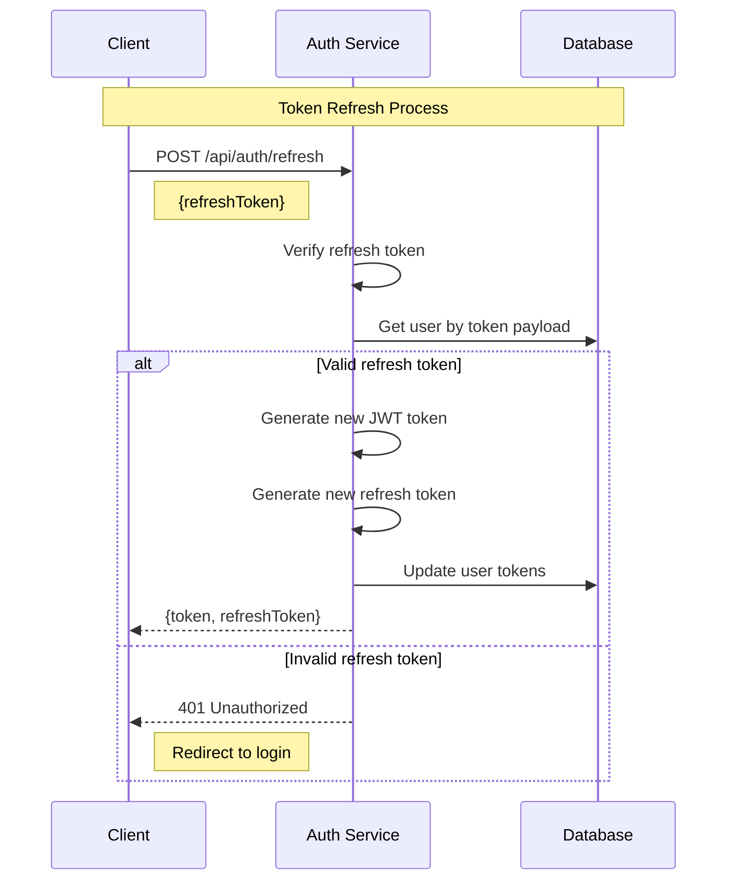
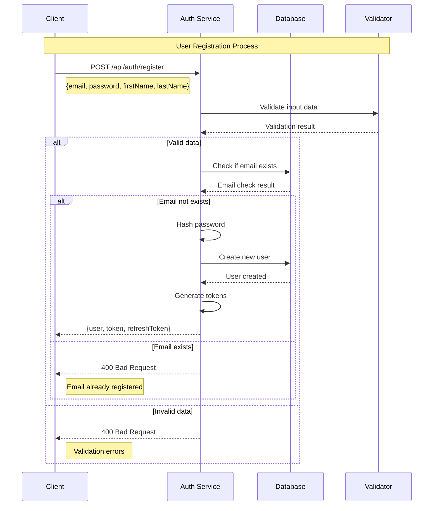
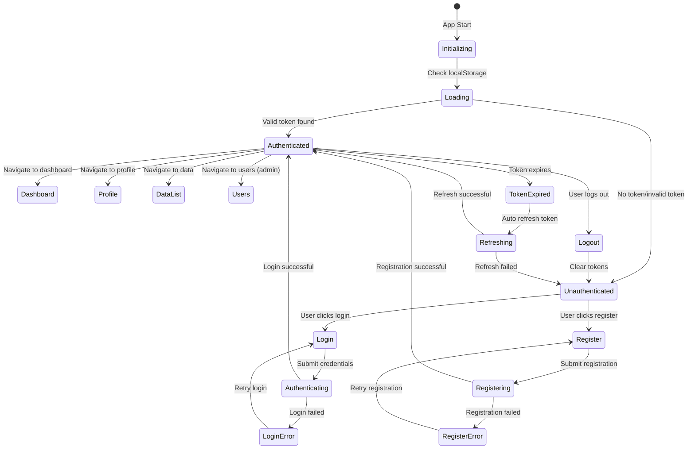
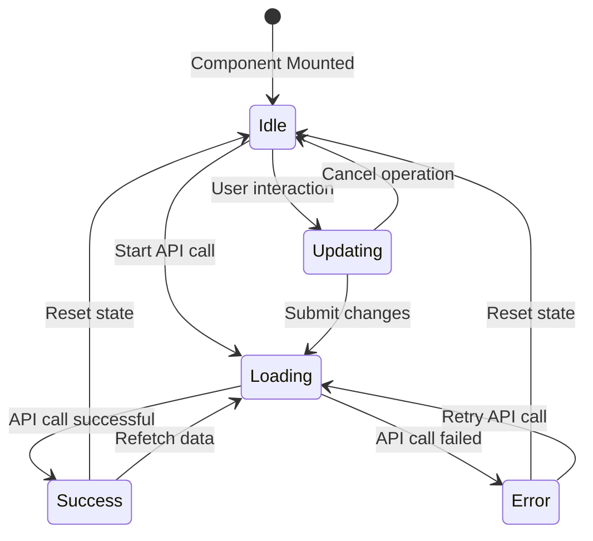
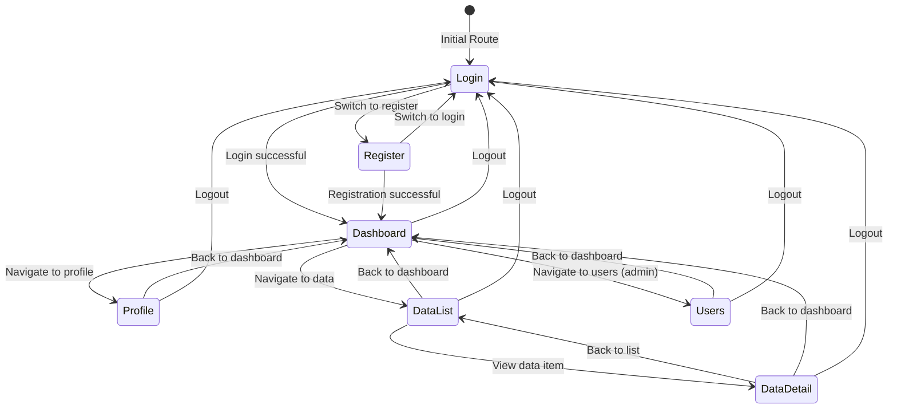
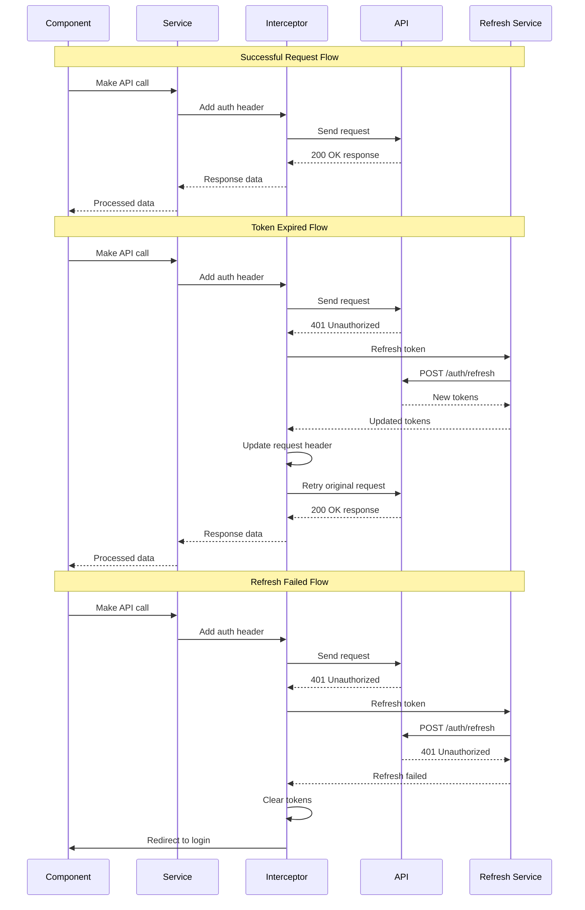
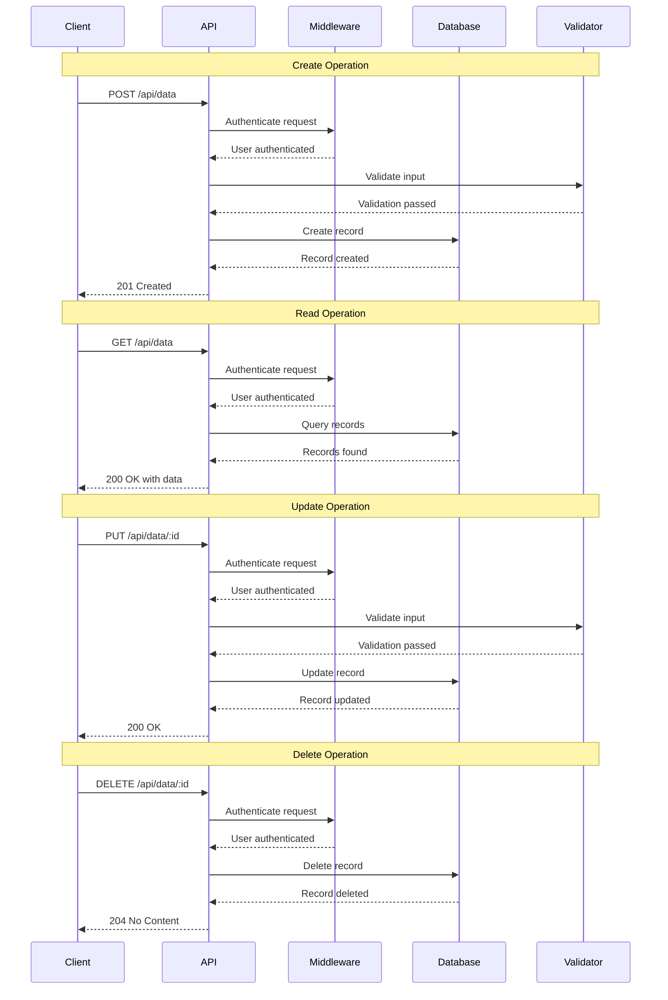

# 📊 Sistem Mimarisi

## Genel Bakış

Fourth platformu, mikroservis tabanlı, ölçeklenebilir ve güvenli bir mimariye sahiptir. Bu dokümanda sistem mimarisi, bileşenler arası etkileşimler ve veri akışları detaylandırılmıştır.

## 🏗️ Genel Mimari

### Sistem Mimarisi Diyagramı


## 🔄 Veri Akışı

### Kullanıcı Etkileşim Akışı


## 🏢 Mikroservis Mimarisi

### Servis Detayları


## 🗄️ Veri Mimarisi

### Veritabanı Şeması


## 🔐 Güvenlik Mimarisi

### Güvenlik Katmanları


## 📊 Monitoring ve Observability

### Monitoring Mimarisi


## 🚀 Deployment Mimarisi

### Kubernetes Deployment


## 🔄 CI/CD Pipeline

### Deployment Pipeline


## 🌐 Global Distribution

### Multi-Region Architecture


## 🔧 AI/ML Mimarisi

### AI Pipeline


## 📱 Mobile Architecture

### Mobile App Architecture


## 🔄 Event-Driven Architecture

### Event Flow


## 🔄 Backend API Flow Diyagramları

### Authentication Flow



### Token Refresh Flow



### User Registration Flow



## 🎨 Frontend State Management Diyagramları

### Authentication State Flow



### Component State Management



### Navigation State Flow



## 🔄 API Request/Response Flow

### HTTP Request Interceptor Flow



## 🗄️ Database Operations Flow

### CRUD Operations Flow



## 🔐 Security Flow Diyagramları

### JWT Token Lifecycle

```mermaid
stateDiagram-v2
    [*] --> Generated: User Login
    
    Generated --> Valid: Token created
    Valid --> Used: API request
    Used --> Valid: Request successful
    Used --> Expired: Token expires
    Used --> Invalid: Token tampered
    
    Expired --> Refreshed: Refresh token valid
    Expired --> Revoked: Refresh token invalid
    
    Invalid --> Revoked: Token compromised
    Revoked --> [*]: User must re-login
    
    Refreshed --> Valid: New token issued
    Refreshed --> Revoked: Refresh failed
```

### Password Security Flow

```mermaid
sequenceDiagram
    participant U as User
    participant C as Client
    participant A as API
    participant H as Hash Service
    participant DB as Database
    
    Note over U,DB: Password Registration
    U->>C: Enter password
    C->>A: POST /auth/register
    A->>H: Hash password
    H->>H: Generate salt
    H->>H: Hash with bcrypt
    H-->>A: Hashed password
    A->>DB: Store user with hash
    DB-->>A: User created
    A-->>C: Registration success
    
    Note over U,DB: Password Verification
    U->>C: Enter password
    C->>A: POST /auth/login
    A->>DB: Get user by email
    DB-->>A: User with hash
    A->>H: Compare password
    H->>H: Hash input password
    H->>H: Compare with stored hash
    H-->>A: Password match result
    
    alt Password matches
        A-->>C: Login successful
    else Password doesn't match
        A->>DB: Increment failed attempts
        A-->>C: Login failed
    end
```

## 📱 Mobile App State Flow

### Mobile Navigation State

```mermaid
stateDiagram-v2
    [*] --> SplashScreen: App Launch
    
    SplashScreen --> LoginScreen: No auth token
    SplashScreen --> MainApp: Valid auth token
    
    LoginScreen --> RegisterScreen: Switch to register
    LoginScreen --> MainApp: Login successful
    LoginScreen --> ForgotPasswordScreen: Forgot password
    
    RegisterScreen --> LoginScreen: Switch to login
    RegisterScreen --> MainApp: Registration successful
    
    ForgotPasswordScreen --> LoginScreen: Back to login
    
    MainApp --> HomeScreen: Default tab
    MainApp --> ArticlesScreen: Articles tab
    MainApp --> QuestionsScreen: Questions tab
    MainApp --> ExpertsScreen: Experts tab
    MainApp --> ChatScreen: Chat tab
    MainApp --> ProfileScreen: Profile tab
    MainApp --> SettingsScreen: Settings tab
    
    HomeScreen --> ArticleDetailScreen: View article
    HomeScreen --> QuestionDetailScreen: View question
    HomeScreen --> ExpertDetailScreen: View expert
    
    ArticlesScreen --> ArticleDetailScreen: Select article
    QuestionsScreen --> QuestionDetailScreen: Select question
    ExpertsScreen --> ExpertDetailScreen: Select expert
    
    ArticleDetailScreen --> HomeScreen: Back
    QuestionDetailScreen --> HomeScreen: Back
    ExpertDetailScreen --> HomeScreen: Back
    
    ProfileScreen --> LoginScreen: Logout
    SettingsScreen --> LoginScreen: Logout
```

### Mobile Authentication State

```mermaid
stateDiagram-v2
    [*] --> CheckingAuth: App Start
    
    CheckingAuth --> Authenticated: Token valid
    CheckingAuth --> Unauthenticated: No token/invalid
    
    Unauthenticated --> LoginScreen: Show login
    Unauthenticated --> RegisterScreen: Show register
    
    LoginScreen --> Authenticating: Submit login
    Authenticating --> Authenticated: Login success
    Authenticating --> LoginError: Login failed
    LoginError --> LoginScreen: Show error
    
    RegisterScreen --> Registering: Submit register
    Registering --> Authenticated: Register success
    Registering --> RegisterError: Register failed
    RegisterError --> RegisterScreen: Show error
    
    Authenticated --> MainApp: Enter app
    Authenticated --> TokenExpired: Token expires
    TokenExpired --> Refreshing: Auto refresh
    Refreshing --> Authenticated: Refresh success
    Refreshing --> Unauthenticated: Refresh failed
    
    Authenticated --> Logout: User logout
    Logout --> Unauthenticated: Clear tokens
```

## 🔄 Real-time Communication Flow

### WebSocket Connection Flow

```mermaid
sequenceDiagram
    participant C as Client
    participant S as Server
    participant WS as WebSocket
    participant A as Auth Service
    participant DB as Database
    
    Note over C,DB: WebSocket Connection
    C->>S: Connect to WebSocket
    S->>A: Authenticate connection
    A-->>S: Authentication result
    
    alt Authenticated
        S->>WS: Establish connection
        WS-->>C: Connection established
        C->>WS: Join chat room
        WS->>DB: Update user status
        WS-->>C: Joined room
        
        Note over C,DB: Message Exchange
        C->>WS: Send message
        WS->>DB: Save message
        WS->>WS: Broadcast to room
        WS-->>C: Message delivered
        
        Note over C,DB: Disconnection
        C->>WS: Disconnect
        WS->>DB: Update user status
        WS-->>C: Disconnected
    else Not authenticated
        S-->>C: Connection rejected
    end
```

## 🎯 Sonuç

Fourth platformu, modern mikroservis mimarisi prensiplerine dayalı, ölçeklenebilir ve güvenli bir sistem olarak tasarlanmıştır. Bu mimari:

### Temel Özellikler
- **Mikroservis Tabanlı**: Bağımsız, ölçeklenebilir servisler
- **Event-Driven**: Asenkron, esnek iletişim
- **Cloud-Native**: Bulut tabanlı, containerized deployment
- **AI-Integrated**: Yapay zeka destekli akıllı servisler
- **Multi-Region**: Global dağıtım ve yüksek erişilebilirlik

### Teknik Avantajlar
- **Ölçeklenebilirlik**: Horizontal ve vertical scaling
- **Güvenilirlik**: Fault tolerance ve disaster recovery
- **Performans**: Optimized data flow ve caching
- **Güvenlik**: Multi-layer security architecture
- **Observability**: Comprehensive monitoring ve logging

### Flow ve State Yönetimi
- **Authentication Flow**: JWT tabanlı güvenli kimlik doğrulama
- **State Management**: React Context ve Redux benzeri state yönetimi
- **API Flow**: Interceptor tabanlı otomatik token yenileme
- **Navigation Flow**: Role-based routing ve protected routes
- **Real-time Flow**: WebSocket tabanlı gerçek zamanlı iletişim

Bu mimari, Fourth platformunun hedeflerini gerçekleştirmek için gerekli tüm bileşenleri sağlar ve gelecekteki geliştirmeler için esnek bir temel oluşturur.
